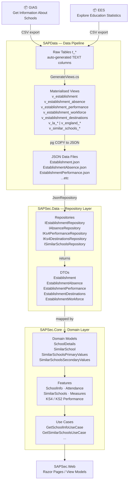

# Entity Relationship Diagram — SAP Sector

> This document describes the data entities, their attributes, and the relationships between them in the `DFE-Digital/sap-sector` application.

## Table of Contents

1. [Overview](#overview)
2. [Architecture Summary](#architecture-summary)
3. [Core Domain Entities](#1-core-domain-entities)
4. [Data Transfer Objects (DTOs)](#2-data-transfer-objects-dtos)
5. [Database Views (PostgreSQL)](#3-database-views-postgresql)
6. [Feature-Level Domain Objects](#4-feature-level-domain-objects)
7. [Enumerations & Value Objects](#5-enumerations--value-objects)
8. [Full ERD — All Entities & Relationships](#6-full-erd--all-entities--relationships)
9. [Data Flow Diagram](#7-data-flow-diagram)

---

## Overview

The SAP Sector application is a .NET solution that surfaces school performance data for the Department for Education (DfE). It ingests data from two external sources:

| Source | Description |
|--------|-------------|
| **GIAS** | Get Information About Schools — provides establishment metadata |
| **EES** | Explore Education Statistics — provides attainment, absence, destinations and workforce data |

Data is loaded into **PostgreSQL raw tables**, transformed into **materialised views**, serialised to **JSON files**, and then served via a **web application** using the repository pattern.

---

## Architecture Summary

```
GIAS / EES CSV files
        │
        ▼
  Raw Tables (t_*)        ← GenerateRawTables.cs
        │
        ▼
  Materialised Views      ← GenerateViews.cs
  (v_establishment, v_establishment_absence, …)
        │
        ▼
  JSON Data Files         ← SAPSec.Infrastructure / Json
        │
        ▼
  DTOs (SAPSec.Data)
        │
        ▼
  Domain / Feature Models (SAPSec.Core)
        │
        ▼
  Web Application (SAPSec.Web)
```

---

## 1. Core Domain Entities

### 1.1 SchoolDetails

> Defined in `SAPSec.Core/Model/SchoolDetails.cs`  
> The primary domain object representing a school and all its attributes. All fields use `DataWithAvailability<T>` to express whether data is present, redacted, or not applicable.

| Property | Type | Notes |
|----------|------|-------|
| `Urn` | `string` | **Primary Key** — Unique Reference Number |
| `Name` | `string` | School display name |
| `DfENumber` | `DataWithAvailability<string>` | DfE establishment number |
| `Ukprn` | `DataWithAvailability<string>` | UK Provider Reference Number |
| `Address` | `DataWithAvailability<string>` | Full formatted address |
| `LocalAuthorityName` | `DataWithAvailability<string>` | LA name |
| `LocalAuthorityCode` | `DataWithAvailability<string>` | **FK** → LocalAuthority |
| `Region` | `DataWithAvailability<string>` | GOR region name |
| `UrbanRuralDescription` | `DataWithAvailability<string>` | Urban/rural classification |
| `AgeRangeLow` | `DataWithAvailability<int>` | Lower statutory age |
| `AgeRangeHigh` | `DataWithAvailability<int>` | Upper statutory age |
| `GenderOfEntry` | `DataWithAvailability<string>` | Admissions gender |
| `PhaseOfEducation` | `DataWithAvailability<string>` | Primary / Secondary / etc. |
| `SchoolType` | `DataWithAvailability<string>` | Type of establishment |
| `AdmissionsPolicy` | `DataWithAvailability<string>` | Selective / Non-selective |
| `ReligiousCharacter` | `DataWithAvailability<string>` | Religious character |
| `GovernanceStructure` | `DataWithAvailability<GovernanceType>` | **FK** → GovernanceType enum |
| `AcademyTrustName` | `DataWithAvailability<string>` | Trust name if applicable |
| `AcademyTrustId` | `DataWithAvailability<string>` | **FK** → Trust (GIAS group) |
| `HasNurseryProvision` | `DataWithAvailability<bool>` | |
| `HasSixthForm` | `DataWithAvailability<bool>` | |
| `HasSenUnit` | `DataWithAvailability<bool>` | |
| `HasResourcedProvision` | `DataWithAvailability<bool>` | |
| `HeadteacherName` | `DataWithAvailability<string>` | |
| `Website` | `DataWithAvailability<string>` | |
| `Telephone` | `DataWithAvailability<string>` | |
| `Email` | `DataWithAvailability<string>` | |

---

## 2. Data Transfer Objects (DTOs)

DTOs are auto-generated from materialised view schemas and live in `Data/SAPSec.Data/Dto/`.

### 2.1 Establishment

> View: `v_establishment` | Source: GIAS

| Column | Type | Notes |
|--------|------|-------|
| `URN` | `string` | **PK** |
| `LAId` | `string` | **FK** → LocalAuthority |
| `LAName` | `string` | |
| `RegionId` | `string` | **FK** → Region |
| `RegionName` | `string` | |
| `EstablishmentName` | `string` | |
| `EstablishmentNumber` | `string` | |
| `EstablishmentStatusId` | `string` | |
| `EstablishmentStatusName` | `string` | |
| `LAESTAB` | `string` | Composite: LAId + EstablishmentNumber |
| `TrustId` | `string` | **FK** → Trust |
| `TrustName` | `string` | |
| `AdmissionsPolicyId` | `string` | |
| `AdmissionsPolicyName` | `string` | |
| `DistrictAdministrativeId` | `string` | |
| `DistrictAdministrativeName` | `string` | |
| `PhaseOfEducationId` | `string` | |
| `PhaseOfEducationName` | `string` | |
| `GenderId` | `string` | |
| `GenderName` | `string` | |
| `ReligiousCharacterId` | `string` | |
| `ReligiousCharacterName` | `string` | |
| `TelephoneNum` | `string` | |
| `TotalCapacity` | `int?` | |
| `TotalPupils` | `int?` | |
| `TypeOfEstablishmentId` | `string` | |
| `TypeOfEstablishmentName` | `string` | |
| `EstablishmentTypeGroupId` | `string` | |
| `EstablishmentTypeGroupName` | `string` | |
| `ResourcedProvisionId` | `string` | |
| `ResourcedProvisionName` | `string` | |
| `NurseryProvisionName` | `string` | |
| `OfficialSixthFormId` | `string` | |
| `OfficialSixthFormName` | `string` | |
| `TrustSchoolFlagId` | `string` | |
| `TrustSchoolFlagName` | `string` | |
| `UKPRN` | `string` | |
| `Street` | `string` | |
| `Locality` | `string` | |
| `Address3` | `string` | |
| `Town` | `string` | |
| `County` | `string` | |
| `Postcode` | `string` | |
| `HeadTitle` | `string` | |
| `HeadFirstName` | `string` | |
| `HeadLastName` | `string` | |
| `HeadPreferredJobTitle` | `string` | |
| `UrbanRuralId` | `string` | |
| `UrbanRuralName` | `string` | |
| `Website` | `string` | |
| `Easting` | `int?` | BNG coordinates |
| `Northing` | `int?` | BNG coordinates |
| `AgeRangeLow` | `int?` | |
| `AgeRangeHigh` | `int?` | |

---

### 2.2 EstablishmentLinks

> View: `v_establishment_links` | Source: GIAS

| Column | Type | Notes |
|--------|------|-------|
| `urn` | `string` | **PK/FK** → Establishment.URN |
| `linkurn` | `string` | **FK** → Linked Establishment.URN |
| `linkname` | `string` | |
| `linktype` | `string` | Type of link (predecessor, successor, etc.) |
| `linkestablisheddate` | `string` | |

---

### 2.3 EstablishmentEmail

> View: `v_establishment_email` | Source: GIAS

| Column | Type | Notes |
|--------|------|-------|
| `Id` (URN) | `string` | **PK/FK** → Establishment.URN |
| `LAId` | `string` | |
| `LAName` | `string` | |
| `RegionId` | `string` | |
| `RegionName` | `string` | |
| `CloseDate` | `string` | |
| `EstablishmentName` | `string` | |
| `EstablishmentNumber` | `string` | |
| `EstablishmentStatusName` | `string` | |
| `EstablishmentTypeGroupName` | `string` | |
| `MainEmail` | `string` | |
| `PhaseOfEducationName` | `string` | |
| `TypeOfEstablishmentName` | `string` | |
| `URN` | `string` | |

---

### 2.4 EstablishmentAbsence

> View: `v_establishment_absence` | Source: EES — Pupil Absence

| Column | Type | Notes |
|--------|------|-------|
| `Id` | `string` | **PK/FK** → Establishment.URN |
| `LAId` | `string` | |
| `LAName` | `string` | |
| `RegionId` | `string` | |
| `RegionName` | `string` | |
| `Abs_Tot_Est_Current_Pct` | `string` | Overall absence % (current year) |
| `Abs_Tot_Est_Previous_Pct` | `string` | Overall absence % (previous year) |
| `Abs_Tot_Est_Previous2_Pct` | `string` | Overall absence % (2 years ago) |
| `Abs_Persistent_Est_Current_Pct` | `string` | Persistent absence % (current) |
| `Abs_Persistent_Est_Previous_Pct` | `string` | Persistent absence % (previous) |
| `Abs_Persistent_Est_Previous2_Pct` | `string` | Persistent absence % (2 years ago) |
| `Auth_Tot_Est_Current_Pct` | `string` | Authorised absence % |
| `UnAuth_Tot_Est_Current_Pct` | `string` | Unauthorised absence % |

---

### 2.5 LAAbsence

> View: `v_la_absence` | Source: EES — Pupil Absence

| Column | Type | Notes |
|--------|------|-------|
| `Id` | `string` | **PK/FK** → LocalAuthority |
| `Abs_Tot_Secondary_LA_Current_Pct` | `string` | |
| `Abs_Tot_Secondary_LA_Previous_Pct` | `string` | |
| `Abs_Tot_Secondary_LA_Previous2_Pct` | `string` | |
| `Abs_Persistent_Secondary_LA_Current_Pct` | `string` | |
| `Abs_Persistent_Secondary_LA_Previous_Pct` | `string` | |
| `Abs_Persistent_Secondary_LA_Previous2_Pct` | `string` | |
| `Auth_Tot_Secondary_LA_Current_Pct` | `string` | |
| `UnAuth_Tot_Secondary_LA_Current_Pct` | `string` | |

---

### 2.6 EnglandAbsence

> View: `v_england_absence` | Source: EES — Pupil Absence

| Column | Type | Notes |
|--------|------|-------|
| `Id` | `string` | **PK** — national aggregate row |
| `Abs_Tot_Secondary_Eng_Current_Pct` | `string` | |
| `Abs_Persistent_Secondary_Eng_Current_Pct` | `string` | |
| `Auth_Tot_Secondary_Eng_Current_Pct` | `string` | |
| `UnAuth_Tot_Secondary_Eng_Current_Pct` | `string` | |
| `Abs_Tot_Primary_Eng_Current_Pct` | `string` | |
| `Abs_Persistent_Primary_Eng_Current_Pct` | `string` | |
| `Auth_Tot_Primary_Eng_Current_Pct` | `string` | |
| `UnAuth_Tot_Primary_Eng_Current_Pct` | `string` | |

---

### 2.7 KS4 EstablishmentPerformance

> View: `v_establishment_performance` | Source: EES — KS4 Performance

| Column | Type | Notes |
|--------|------|-------|
| `Id` | `string` | **PK/FK** → Establishment.URN |
| `LAId` | `string` | |
| `LAName` | `string` | |
| `RegionId` | `string` | |
| `RegionName` | `string` | |
| `Attainment8_Tot_Est_Current_Num` | `string` | Attainment 8 score (current year) |
| `Attainment8_Tot_Est_Previous_Num` | `string` | Attainment 8 score (previous year) |
| `Attainment8_Tot_Est_Previous2_Num` | `string` | Attainment 8 score (2 years ago) |
| `Bio59_Sum_Est_Current_Pct` | `string` | Biology GCSE grade 5+ % |
| `Chem59_Sum_Est_Current_Pct` | `string` | Chemistry GCSE grade 5+ % |
| `CombSci59_Sum_Est_Current_Pct` | `string` | Combined Science GCSE 5-5+ % |
| `EngLang59_Sum_Est_Current_Pct` | `string` | English Language GCSE 5+ % |
| `EngLit59_Sum_Est_Current_Pct` | `string` | English Literature GCSE 5+ % |
| `EngMaths59_Tot_Est_Current_Pct` | `string` | English & Maths GCSE 5+ % |
| `Maths59_Sum_Est_Current_Pct` | `string` | Maths GCSE 5+ % |
| `Physics59_Sum_Est_Current_Pct` | `string` | Physics GCSE 5+ % |
| *(Many more subject/cohort breakdown fields)* | `string` | See source DTO for full list |

---

### 2.8 KS2 EstablishmentPerformance

> Source: EES — KS2 Performance

| Column | Type | Notes |
|--------|------|-------|
| `Id` | `string` | **PK/FK** → Establishment.URN |
| `RwmExpected_Tot_Cohort_Est_Current_Num` | `string` | RWM expected standard (total) |
| `RwmExpected_Reading_Tot_Cohort_Est_Current_Num` | `string` | Reading |
| `RwmExpected_Writing_Tot_Cohort_Est_Current_Num` | `string` | Writing |
| `RwmExpected_Maths_Tot_Cohort_Est_Current_Num` | `string` | Maths |
| `RwmHigher_Tot_Cohort_Est_Current_Num` | `string` | Higher standard RWM |
| `ReadingScaledScore_Tot_Cohort_Est_Current_Num` | `string` | Reading scaled score |
| `MathsScaledScore_Tot_Cohort_Est_Current_Num` | `string` | Maths scaled score |
| `GpsExpected_Tot_Cohort_Est_Current_Num` | `string` | GPS expected standard |
| *(Repeated for previous year and previous2 year, and segmented by gender/SEN/EAL)* | `string` | See source DTO for full list |

---

### 2.9 EstablishmentDestinations (KS4)

> View: `v_establishment_destinations` | Source: EES — KS4 Destinations

| Column | Type | Notes |
|--------|------|-------|
| `Id` | `string` | **PK/FK** → Establishment.LAESTAB |
| `LAId` | `string` | |
| `LAName` | `string` | |
| `RegionId` | `string` | |
| `RegionName` | `string` | |
| `AllDest_Boy_Est_Current_Num` | `string` | |
| `AllDest_Boy_Est_Current_Pct` | `string` | |
| *(Further destination columns by gender, year)* | `string` | |

---

### 2.10 EstablishmentWorkforce

> View: `v_establishment_workforce` | Source: EES — Workforce

| Column | Type | Notes |
|--------|------|-------|
| `Id` | `string` | **PK/FK** → Establishment.URN |
| `LAId` | `string` | |
| `LAName` | `string` | |
| `RegionId` | `string` | |
| `RegionName` | `string` | |
| `Workforce_PupTeaRatio_Est_Current_Num` | `string` | Pupil-teacher ratio |
| `Workforce_TotPupils_Est_Current_Num` | `string` | Total pupils |

---

## 3. Database Views (PostgreSQL)

The `SAPData` project auto-generates materialised views from raw CSV tables. Key views and their relationships:

| View | Range | Key Column | Source |
|------|-------|------------|--------|
| `v_establishment` | Establishment | `URN` | GIAS |
| `v_establishment_links` | Establishment | `urn` | GIAS |
| `v_establishment_group_links` | Establishment | `group_id` | GIAS |
| `v_establishment_email` | Establishment | `URN` | GIAS |
| `v_establishment_absence` | Establishment | `Id` (URN) | EES |
| `v_establishment_performance` | Establishment | `Id` (URN) | EES |
| `v_establishment_workforce` | Establishment | `Id` (URN) | EES |
| `v_establishment_destinations` | Establishment | `Id` (LAESTAB) | EES |
| `v_establishment_subject_entries` | Establishment | `school_urn` | EES |
| `v_england_absence` | England | `Id` | EES |
| `v_england_destinations` | England | `Id` | EES |
| `v_england_performance` | England | `Id` | EES |
| `v_la_absence` | LA | `Id` | EES |
| `v_la_destinations` | LA | `Id` | EES |
| `v_la_performance` | LA | `Id` | EES |
| `v_la_subject_entries` | LA | `old_la_code` | EES |
| `v_similar_schools_primary_groups` | Establishment | `URN` | Computed |
| `v_similar_schools_secondary_groups` | Establishment | `URN` | Computed |

---

## 4. Feature-Level Domain Objects

### 4.1 SimilarSchool

> Defined in `SAPSec.Core/Features/SimilarSchools/SimilarSchool.cs`  
> Composed from Establishment + KS4 Performance + Absence DTOs.

| Property | Type | Notes |
|----------|------|-------|
| `URN` | `string` | **PK/FK** → Establishment.URN |
| `Name` | `string` | |
| `Address` | `Address` | Street, Locality, Address3, Town, Postcode |
| `Coordinates` | `BNGCoordinates?` | Easting / Northing |
| `TotalCapacity` | `int?` | |
| `TotalPupils` | `int?` | |
| `NurseryProvisionName` | `string` | |
| `LocalAuthority` | `ReferenceData` | Id + Name |
| `Region` | `ReferenceData` | |
| `UrbanRural` | `ReferenceData` | |
| `PhaseOfEducation` | `ReferenceData` | |
| `OfficialSixthForm` | `ReferenceData` | |
| `AdmissionsPolicy` | `ReferenceData` | |
| `Gender` | `ReferenceData` | |
| `ResourcedProvision` | `ReferenceData` | |
| `TypeOfEstablishment` | `ReferenceData` | |
| `EstablishmentTypeGroup` | `ReferenceData` | |
| `TrustSchoolFlag` | `ReferenceData` | |
| `Attainment8Score` | `DataWithAvailability<decimal>` | |
| `BiologyGcseGrade5AndAbovePercentage` | `DataWithAvailability<decimal>` | |
| `ChemistryGcseGrade5AndAbovePercentage` | `DataWithAvailability<decimal>` | |
| `CombinedScienceGcseGrade55AndAbovePercentage` | `DataWithAvailability<decimal>` | |
| `EnglishLanguageGcseGrade5AndAbovePercentage` | `DataWithAvailability<decimal>` | |
| `EnglishLiteratureGcseGrade5AndAbovePercentage` | `DataWithAvailability<decimal>` | |
| `EnglishMathsGcseGrade5AndAbovePercentage` | `DataWithAvailability<decimal>` | |
| `MathsGcseGrade5AndAbovePercentage` | `DataWithAvailability<decimal>` | |
| `PhysicsGcseGrade5AndAbovePercentage` | `DataWithAvailability<decimal>` | |
| `OverallAbsenceRate` | `DataWithAvailability<decimal>` | |
| `PersistentAbsenceRate` | `DataWithAvailability<decimal>` | |

---

### 4.2 SimilarSchoolsPrimaryValues

> Defined in `SAPSec.Core/Features/SimilarSchools/SimilarSchoolsPrimaryValues.cs`

| Property | Type | Notes |
|----------|------|-------|
| `Urn` | `string` | **FK** → Establishment.URN |
| `ReadMatAverage` | `decimal` | KS2 reading/maths average |
| `Ks1PriorRwmAverage` | `decimal` | KS1 prior attainment average |
| `PupilPremiumEligibilityPercentage` | `decimal` | |
| `PupilsWithEalPercentage` | `decimal` | EAL pupils % |
| `Polar4Quintile` | `decimal` | Higher Education participation quintile |
| `PupilStabilityRate` | `decimal` | |
| `AverageIdaciScore` | `decimal` | Deprivation score |
| `PupilsWithSenSupportPercentage` | `decimal` | |
| `PupilCount` | `decimal` | |
| `PupilsWithEhcPlanPercentage` | `decimal` | |

---

### 4.3 SimilarSchoolsSecondaryValues

> Defined in `SAPSec.Core/Features/SimilarSchools/SimilarSchoolsSecondaryValues.cs`

| Property | Type | Notes |
|----------|------|-------|
| `Urn` | `string` | **FK** → Establishment.URN |
| `Ks2AverageScore` | `decimal` | KS2 prior attainment (MRP) |
| `PupilPremiumEligibilityPercentage` | `decimal` | |
| `PupilsWithEalPercentage` | `decimal` | |
| `Polar4Quintile` | `decimal` | |
| `PupilStabilityRate` | `decimal` | |
| `AverageIdaciScore` | `decimal` | |
| `PupilsWithSenSupportPercentage` | `decimal` | |
| `PupilCount` | `decimal` | |
| `PupilsWithEhcPlanPercentage` | `decimal` | |

---

### 4.4 SchoolInfo

> Defined in `SAPSec.Core/Features/SchoolInfo/SchoolInfo.cs`  
> Lightweight projection used in page headers and breadcrumbs.

| Property | Type | Notes |
|----------|------|-------|
| `Urn` | `string` | **FK** → Establishment.URN |
| `Name` | `string` | |
| `LocalAuthority` | `LocalAuthority` | Id + Name |
| `Address` | `Address` | Street, Locality, Town, Postcode |

---

### 4.5 Measure

> Defined in `SAPSec.Core/Features/Measures/Measure.cs`  
> Represents a single chart-ready performance measure with national / LA / school data series.

| Property | Type | Notes |
|----------|------|-------|
| `Key` | `string` | Measure identifier |
| `Name` | `string` | Display name |
| `DataType` | `MeasureDataType` | Score / GradePercentage / Absence % |
| `Filters` | `IReadOnlyCollection<MeasureAvailableFilter>` | Available filter options |
| `Series` | `IReadOnlyCollection<MeasureSeries>` | School / LA / England time series |
| `TopPerformers` | `IReadOnlyCollection<TopPerformer>?` | Similar schools ranked by this measure |

---

## 5. Enumerations & Value Objects

### GovernanceType (enum)

| Value | Description |
|-------|-------------|
| `MultiAcademyTrust` | Part of a Multi-Academy Trust |
| `SingleAcademyTrust` | Standalone academy (Single Academy Trust) |
| `LocalAuthorityMaintained` | LA-maintained school |
| `NonMaintainedSpecialSchool` | Non-maintained special school |
| `Independent` | Independent school |
| `FurtherHigherEducation` | FE/HE institution |
| `Other` | Other governance type |

### DataAvailabilityStatus (enum)

| Value | Description |
|-------|-------------|
| `Available` | Data is present and reliable |
| `NotAvailable` | Data is missing |
| `Redacted` | Suppressed (e.g. small cohort sizes) |
| `NotApplicable` | Does not apply to this establishment |
| `Low` | Data present but low quality |

### MeasureDataType (enum)

| Value | Description |
|-------|-------------|
| `Score` | Raw numeric score |
| `ScaledScore` | Scaled / standardised score |
| `GradePercentage` | % of pupils achieving a grade threshold |
| `OverallAbsencePercentage` | % overall absence |
| `PersistentAbsencePercentage` | % persistent absence |

### ReferenceData (value object)

A simple `record(string Id, string Name)` used throughout the domain to carry a lookup code plus display name pair (e.g. `LocalAuthority`, `Region`, `Gender`, `PhaseOfEducation`, `UrbanRural`).

---

## 6. Full ERD — All Entities & Relationships

```mermaid
erDiagram

    Establishment {
        string URN PK
        string LAId FK
        string RegionId FK
        string TrustId FK
        string LAESTAB
        string UKPRN
        string EstablishmentName
        string EstablishmentNumber
        string EstablishmentStatusId
        string EstablishmentStatusName
        string PhaseOfEducationId
        string PhaseOfEducationName
        string GenderId
        string GenderName
        string TypeOfEstablishmentId
        string TypeOfEstablishmentName
        string EstablishmentTypeGroupId
        string EstablishmentTypeGroupName
        string AdmissionsPolicyId
        string AdmissionsPolicyName
        string ReligiousCharacterId
        string ReligiousCharacterName
        string UrbanRuralId
        string UrbanRuralName
        string OfficialSixthFormId
        string OfficialSixthFormName
        string NurseryProvisionName
        string ResourcedProvisionId
        string ResourcedProvisionName
        string TrustSchoolFlagId
        string TrustSchoolFlagName
        string Street
        string Locality
        string Address3
        string Town
        string County
        string Postcode
        string Website
        string TelephoneNum
        string HeadFirstName
        string HeadLastName
        string HeadPreferredJobTitle
        int TotalCapacity
        int TotalPupils
        int Easting
        int Northing
        int AgeRangeLow
        int AgeRangeHigh
    }

    EstablishmentLinks {
        string urn FK
        string linkurn FK
        string linkname
        string linktype
        string linkestablisheddate
    }

    EstablishmentEmail {
        string URN PK
        string LAId FK
        string RegionId FK
        string MainEmail
        string EstablishmentName
        string EstablishmentStatusName
        string PhaseOfEducationName
        string CloseDate
    }

    EstablishmentWorkforce {
        string Id PK
        string LAId FK
        string RegionId FK
        string Workforce_PupTeaRatio_Est_Current_Num
        string Workforce_TotPupils_Est_Current_Num
    }

    EstablishmentAbsence {
        string Id PK
        string LAId FK
        string RegionId FK
        string Abs_Tot_Est_Current_Pct
        string Abs_Tot_Est_Previous_Pct
        string Abs_Tot_Est_Previous2_Pct
        string Abs_Persistent_Est_Current_Pct
        string Abs_Persistent_Est_Previous_Pct
        string Abs_Persistent_Est_Previous2_Pct
        string Auth_Tot_Est_Current_Pct
        string UnAuth_Tot_Est_Current_Pct
    }

    LAAbsence {
        string Id PK
        string Abs_Tot_Secondary_LA_Current_Pct
        string Abs_Persistent_Secondary_LA_Current_Pct
        string Auth_Tot_Secondary_LA_Current_Pct
        string UnAuth_Tot_Secondary_LA_Current_Pct
    }

    EnglandAbsence {
        string Id PK
        string Abs_Tot_Secondary_Eng_Current_Pct
        string Abs_Persistent_Secondary_Eng_Current_Pct
        string Abs_Tot_Primary_Eng_Current_Pct
        string Abs_Persistent_Primary_Eng_Current_Pct
    }

    KS4EstablishmentPerformance {
        string Id PK
        string LAId FK
        string RegionId FK
        string Attainment8_Tot_Est_Current_Num
        string Attainment8_Tot_Est_Previous_Num
        string Attainment8_Tot_Est_Previous2_Num
        string Bio59_Sum_Est_Current_Pct
        string Chem59_Sum_Est_Current_Pct
        string CombSci59_Sum_Est_Current_Pct
        string EngLang59_Sum_Est_Current_Pct
        string EngLit59_Sum_Est_Current_Pct
        string EngMaths59_Tot_Est_Current_Pct
        string Maths59_Sum_Est_Current_Pct
        string Physics59_Sum_Est_Current_Pct
    }

    KS4LAPerformance {
        string Id PK
    }

    KS4EnglandPerformance {
        string Id PK
    }

    KS2EstablishmentPerformance {
        string Id PK
        string RwmExpected_Tot_Cohort_Est_Current_Num
        string RwmHigher_Tot_Cohort_Est_Current_Num
        string ReadingScaledScore_Tot_Cohort_Est_Current_Num
        string MathsScaledScore_Tot_Cohort_Est_Current_Num
        string GpsExpected_Tot_Cohort_Est_Current_Num
    }

    EstablishmentDestinations {
        string Id PK
        string LAId FK
        string RegionId FK
        string AllDest_Boy_Est_Current_Pct
        string AllDest_Boy_Est_Previous_Pct
    }

    LADestinations {
        string Id PK
    }

    EnglandDestinations {
        string Id PK
    }

    SimilarSchoolsSecondaryGroup {
        string URN PK
        string NeighbourURN FK
    }

    SimilarSchoolsPrimaryGroup {
        string URN PK
        string NeighbourURN FK
    }

    SimilarSchoolsPrimaryValues {
        string Urn PK
        decimal ReadMatAverage
        decimal Ks1PriorRwmAverage
        decimal PupilPremiumEligibilityPercentage
        decimal PupilsWithEalPercentage
        decimal Polar4Quintile
        decimal PupilStabilityRate
        decimal AverageIdaciScore
        decimal PupilsWithSenSupportPercentage
        decimal PupilCount
        decimal PupilsWithEhcPlanPercentage
    }

    SimilarSchoolsSecondaryValues {
        string Urn PK
        decimal Ks2AverageScore
        decimal PupilPremiumEligibilityPercentage
        decimal PupilsWithEalPercentage
        decimal Polar4Quintile
        decimal PupilStabilityRate
        decimal AverageIdaciScore
        decimal PupilsWithSenSupportPercentage
        decimal PupilCount
        decimal PupilsWithEhcPlanPercentage
    }

    %% ── Establishment relationships ──
    Establishment ||--o{ EstablishmentLinks : "has links (urn)"
    EstablishmentLinks }o--|| Establishment : "linked to (linkurn)"
    Establishment ||--o| EstablishmentEmail : "has email (URN)"
    Establishment ||--o| EstablishmentAbsence : "has absence (Id=URN)"
    Establishment ||--o| EstablishmentWorkforce : "has workforce (Id=URN)"
    Establishment ||--o| KS4EstablishmentPerformance : "has KS4 performance (Id=URN)"
    Establishment ||--o| KS2EstablishmentPerformance : "has KS2 performance (Id=URN)"
    Establishment ||--o| EstablishmentDestinations : "has destinations (Id=LAESTAB)"

    %% ── Similar schools ──
    Establishment ||--o{ SimilarSchoolsSecondaryGroup : "is in secondary group"
    Establishment ||--o{ SimilarSchoolsPrimaryGroup : "is in primary group"
    SimilarSchoolsSecondaryGroup }o--|| Establishment : "neighbour (NeighbourURN)"
    SimilarSchoolsPrimaryGroup }o--|| Establishment : "neighbour (NeighbourURN)"
    Establishment ||--o| SimilarSchoolsPrimaryValues : "has primary values"
    Establishment ||--o| SimilarSchoolsSecondaryValues : "has secondary values"

    %% ── Absence hierarchy ──
    EstablishmentAbsence }o--|| LAAbsence : "LA context (LAId)"
    EstablishmentAbsence }o--|| EnglandAbsence : "England context"

    %% ── KS4 Performance hierarchy ──
    KS4EstablishmentPerformance }o--|| KS4LAPerformance : "LA context (LAId)"
    KS4EstablishmentPerformance }o--|| KS4EnglandPerformance : "England context"

    %% ── Destinations hierarchy ──
    EstablishmentDestinations }o--|| LADestinations : "LA context (LAId)"
    EstablishmentDestinations }o--|| EnglandDestinations : "England context"
```



---

## 7. Data Flow Diagram



---
