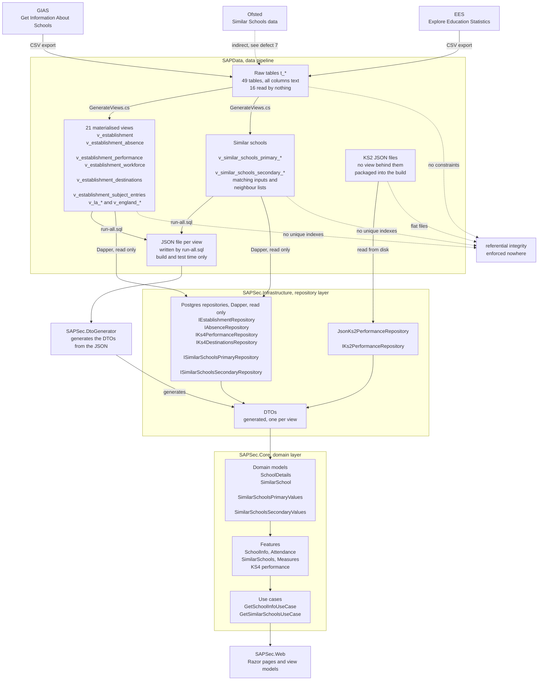

# Entity Relationship Diagram, SAP Sector

> Physical data model for `DFE-Digital/sap-sector`. Describes what the PostgreSQL database actually contains, rebuilt from the pgAdmin DDL dump and the 21 materialised view definitions.
>
> This is the physical model.

For the system boundary and data flows, see the [High-Level Design](./high-level-design.md). For how the application reads these views, see the [Low-Level Design](./low-level-design.md).

## Table of contents

1. [How to read this document](#1-how-to-read-this-document)
2. [Architecture summary](#2-architecture-summary)
3. [Column naming convention](#3-column-naming-convention)
4. [Establishment views](#4-establishment-views)
5. [Local authority views](#5-local-authority-views)
6. [England views](#6-england-views)
7. [Similar schools views](#7-similar-schools-views)
8. [Key and grain reference](#8-key-and-grain-reference)
9. [Full ERD](#9-full-erd)
10. [Data flow](#10-data-flow)
11. [Raw tables](#11-raw-tables)
12. [Known defects](#12-known-defects)

---

## 1. How to read this document

There are no constraints in this database. Not one primary key, foreign key, unique constraint, NOT NULL or index exists in the DDL. Every column in every raw table is `text`.

So every key marked below is a **logical key**, meaning the column set that is in fact unique given how the view is built. It is a claim about the data, not something the database enforces. Where a key is unique because of a `GROUP BY` in the view definition it is safe. Where it depends on the incoming CSV it is an assumption and is marked as one.

Notation used in the tables below.

| Mark | Meaning |
| --- | --- |
| `PK` | logical key, unique by construction |
| `PK?` | logical key, unique only if the source file behaves |
| `AK` | alternate key, unique or intended to be |
| `FK` | join column, nothing enforces it |
| `copy` | denormalised copy pulled in from `v_establishment`, not an independent value |

---

## 2. Architecture summary

```
GIAS / EES CSV files
        |
        v
  Raw tables t_*              49 tables, every column text, no constraints
        |                     16 of them are read by no view
        v
  Materialised views          21 views, all CREATE MATERIALIZED VIEW
  v_establishment             none has a unique index, so no concurrent refresh
  v_establishment_absence
  v_la_* / v_england_*
  v_similar_schools_*
        |
        +---> JSON file per view      build and test time only
        |            |                fixtures for the automated tests
        |            v
        |     SAPSec.DtoGenerator     generates the DTOs from those files
        |            |
        v            v
  Repositories                Dapper, read only, one query per view
  SAPSec.Infrastructure
        |
        v
  DTOs, SAPSec.Data           generated, not hand written
        |
        v
  Domain models, SAPSec.Core
        |
        v
  Web application, SAPSec.Web
```

The JSON files are a build-time artefact, not a runtime data path. The application reads the views directly through Dapper. The DTOs it maps those rows onto are generated from the JSON, so the DTO shape follows the view shape rather than being maintained by hand.

KS2 performance is the one exception. There is no KS2 view in the database at all. KS2 is served from JSON packaged into the deployment artefact and read by `JsonKs2PerformanceRepository` at runtime. See defect 5 and section 15 of the [LLD](./low-level-design.md).

Referential integrity is enforced at exactly zero points in that chain. The views are the only place it could be added cheaply, via unique indexes, and it has not been.

---

## 3. Column naming convention

The generated views use a positional naming scheme. Learn it once and the 361 column views become readable.

```
<Measure>_<Breakdown>_<Geography>_<Period>_<Type>

Attainment8_Tot_Est_Current_Num
Abs_Persistent_Est_Previous2_Pct
EngMaths59_Tot_LA_Current_Pct
```

| Segment | Values | Meaning |
| --- | --- | --- |
| Measure | `Abs_Tot`, `Abs_Persistent`, `Auth_Tot`, `UnAuth_Tot`, `Attainment8`, `AllDest`, `Education`, `Employment`, `Apprentice`, `Workforce_PupTeaRatio`, `Workforce_TotPupils` | the metric |
| Measure, subjects | `Bio`, `Chem`, `Physics`, `CombSci`, `EngLang`, `EngLit`, `EngMaths`, `Maths` suffixed `49`, `59` or `79` | grade 4 and above, 5 and above, 7 and above |
| Breakdown | `Tot`, `Sum`, `Boy`, `Grl`, `Dis`, `NDi`, `EAL`, `Mob`, `NMo` | total, summary, boys, girls, disadvantaged, not disadvantaged, English as additional language, mobile, non mobile |
| Geography | `Est`, `LA`, `Eng` | establishment, local authority, England |
| Period | `Current`, `Previous`, `Previous2` | see the period note below |
| Type | `Num`, `Pct` | count or score, versus percentage |

Two things this scheme hides.

**Periods are hard coded and differ per view.** There is no year column anywhere. `Current` means a different academic year depending on which view you are in.

| View | Current | Previous | Previous2 |
| --- | --- | --- | --- |
| absence, all three geographies | 202324 | 202223 | 202122 |
| performance, all three geographies | 202425 | 202324 | 202223 |
| destinations, all three geographies | 202223 | 202122 | not present |
| workforce | 202425 | not present | not present |

Adding a year is a schema change plus a code change plus a JSON contract change, every time.

**The source vocabulary is inconsistent and the views normalise it silently.** The raw breakdown values include `Boys` and `Male`, `Girls` and `Female`, `Not disadvantaged` and `Not known to be disadvantaged`. Different years use different words for the same group. The `CASE` expressions in the views flatten all of that into `Boy`, `Grl` and `NDi`. If a new file uses a fourth spelling the column silently goes null.

---

## 4. Establishment views

### 4.1 v_establishment

> Source `t_edubasealldata202606_842669691a`. 54 columns. Straight projection, no filter, no aggregation.

The spine of the model. Everything else hangs off this.

| Column | Notes |
| --- | --- |
| `URN` | `PK?` unique only if the GIAS extract is |
| `LAESTAB` | `AK?` computed as `la__code_ \|\| establishmentnumber`, not guaranteed unique |
| `UKPRN` | `AK?` |
| `LAId` | `FK` GIAS LA code, assumed equal to the EES `old_la_code` |
| `LAName` | denormalised label |
| `RegionId` | `FK` no region view exists to join to |
| `RegionName` | denormalised label |
| `TrustId` | `FK` assumed to be `group_uid`, unverified |
| `TrustName` | denormalised label |
| `EstablishmentName`, `EstablishmentNumber` | |
| `EstablishmentStatusId`, `EstablishmentStatusName` | open, closed, proposed |
| `PhaseOfEducationId`, `PhaseOfEducationName` | |
| `TypeOfEstablishmentId`, `TypeOfEstablishmentName` | |
| `EstablishmentTypeGroupId`, `EstablishmentTypeGroupName` | |
| `AdmissionsPolicyId`, `AdmissionsPolicyName` | |
| `GenderId`, `GenderName` | |
| `ReligiousCharacterId`, `ReligiousCharacterName` | |
| `UrbanRuralId`, `UrbanRuralName` | |
| `DistrictAdministrativeId`, `DistrictAdministrativeName` | |
| `OfficialSixthFormId`, `OfficialSixthFormName` | |
| `ResourcedProvisionId`, `ResourcedProvisionName` | |
| `NurseryProvisionName` | id column not carried through |
| `TrustSchoolFlagId`, `TrustSchoolFlagName` | |
| `Street`, `Locality`, `Address3`, `Town`, `County`, `Postcode` | |
| `HeadTitle`, `HeadFirstName`, `HeadLastName`, `HeadPreferredJobTitle` | |
| `Website`, `TelephoneNum` | |
| `TotalCapacity`, `TotalPupils` | `clean_int` applied |
| `Easting`, `Northing` | `clean_int` applied, British National Grid |
| `AgeRangeLow`, `AgeRangeHigh` | `clean_int` applied |

The 16 paired `Id` and `Name` columns are the reference data of this model. They are not foreign keys. There is no lookup table for any of them, the code and the label are both carried on every establishment row.

`clean_int` is the only place in the whole pipeline where a value is typed. Everything else stays `text` end to end.

### 4.2 v_establishment_links

> Source `t_links_edubasealldata_f1186acaae`. 5 columns. Straight projection.

Predecessor and successor relationships between establishments. Self referencing, many to many.

| Column | Notes |
| --- | --- |
| `urn` | `FK` to `v_establishment.URN` |
| `linkurn` | `FK` to `v_establishment.URN` |
| `linkname` | denormalised name of the linked school |
| `linktype` | predecessor, successor, amalgamation and so on |
| `linkestablisheddate` | |

**No unique key.** One school has many links. The natural key is `urn` plus `linkurn` plus `linktype`, and even that is not guaranteed by the source. The previous version of this document called `urn` a primary key, which cannot be right for a one to many.

### 4.3 v_establishment_group_links

> Source `t_grouplinks_edubaseal_dab2410958`. 21 columns.

Trusts, federations and other GIAS groups.

| Column | Notes |
| --- | --- |
| `group_uid` | `PK?` |
| `group_id` | `AK?` |
| `group_name`, `group_type`, `group_type__code_` | |
| `group_status`, `group_status__code_` | |
| `companies_house_number` | |
| `open_date`, `closed_date`, `incorporated_on__open_date_` | |
| `group_street`, `group_locality`, `group_address_3`, `group_town`, `group_county`, `group_postcode` | |
| `head_of_group_title`, `head_of_group_first_name`, `head_of_group_last_name` | |
| `ukprn` | |

**This view contains no URN.** It cannot be joined to an establishment from its own columns. The only route is `v_establishment.TrustId` matching either `group_uid` or `group_id`, and which of the two is correct has not been established. Query 7 in section 12 settles it.

### 4.4 v_establishment_email

> Source `t_secondary_email_addr_c1553d4c65`, grouped by `urn`, then left joined to `v_establishment`. 14 columns.

| Column | Notes |
| --- | --- |
| `Id` | `PK` the URN, unique by `GROUP BY` |
| `URN` | duplicate of `Id`, carried through the aggregate as well |
| `MainEmail` | the only column here that is not available elsewhere |
| `LAId`, `LAName`, `RegionId`, `RegionName` | `copy` |
| `EstablishmentName`, `EstablishmentNumber`, `EstablishmentStatusName`, `EstablishmentTypeGroupName`, `PhaseOfEducationName`, `TypeOfEstablishmentName` | duplicates of `v_establishment` |
| `CloseDate` | not present on `v_establishment` |

Twelve of the fourteen columns are duplicates. This should be two columns, `Id` and `MainEmail`, plus `CloseDate` promoted onto `v_establishment` where it belongs.

### 4.5 v_establishment_absence

> Source `t_1a_absence_3term_sch_d1b51341e3`, grouped by `school_urn`, then left joined to `v_establishment`. 13 columns.

| Column | Notes |
| --- | --- |
| `Id` | `PK` the URN, unique by `GROUP BY` |
| `LAId`, `LAName`, `RegionId`, `RegionName` | `copy` |
| `Abs_Tot_Est_Current_Pct` | overall absence, 202324 |
| `Abs_Tot_Est_Previous_Pct` | 202223 |
| `Abs_Tot_Est_Previous2_Pct` | 202122 |
| `Abs_Persistent_Est_Current_Pct` | persistent absence, 202324 |
| `Abs_Persistent_Est_Previous_Pct` | 202223 |
| `Abs_Persistent_Est_Previous2_Pct` | 202122 |
| `Auth_Tot_Est_Current_Pct` | authorised, current year only |
| `UnAuth_Tot_Est_Current_Pct` | unauthorised, current year only |

The EES side drives the join. A school present in the absence file but absent from GIAS still produces a row, with null `LAId` and null `LAName`. See defect 3.

### 4.6 v_establishment_workforce

> Source `t_workforce_ptrs_2010__8b26fc7d53`, grouped by `school_urn`, then left joined to `v_establishment`. 7 columns. Period 202425 only.

| Column | Notes |
| --- | --- |
| `Id` | `PK` the URN |
| `LAId`, `LAName`, `RegionId`, `RegionName` | `copy` |
| `Workforce_PupTeaRatio_Est_Current_Num` | pupil to qualified teacher ratio |
| `Workforce_TotPupils_Est_Current_Num` | pupils full time equivalent |

Two measures out of a 22 column source table. Everything else in the workforce file is loaded and discarded.

### 4.7 v_establishment_performance

> Nine source tables unioned on URN, then left joined to `v_establishment`. 361 columns. KS4 only.

| Column group | Count | Notes |
| --- | --- | --- |
| `Id` | 1 | `PK` the URN |
| `LAId`, `LAName`, `RegionId`, `RegionName` | 4 | `copy` |
| `Attainment8_*` | 20 | by breakdown and period |
| `EngMaths49_*`, `EngMaths59_*` | 64 | English and maths combined, both thresholds |
| subject columns | 272 | 8 subjects times 3 thresholds times breakdowns and periods |

Source tables are `t_202425_performance_t_b402b7e022`, `t_202324_performance_t_371eb4e56c`, `t_2022_2023_england_ks_28199246f1`, `t_england_ks4underlyin_effb560d65`, `t_202425_subject_schoo_8512af68ee`, `t_custom_202425_subjec_5359f04f61`, `t_custom_202324_subjec_941996fa46`, `t_custom_202223_subjec_6d3c9ec16a` and `t_202324_subject_schoo_84751f4769`.

Three different source columns are aliased to `Id` across those nine, `school_urn`, `urn` and `unique_reference_number__urn_`. They are unioned as text, so any leading zero or whitespace difference between files produces two distinct ids for one school.

**There is no KS2 data in this view or in any other view.** No `Rwm`, `GpsExpected` or scaled score column exists anywhere in the 21 views. See defect 5.

### 4.8 v_establishment_destinations

> Three source tables unioned on `school_laestab`, then left joined to `v_establishment` on `LAESTAB`. 126 columns. Periods 202223 and 202122.

| Column group | Count | Notes |
| --- | --- | --- |
| `Id` | 1 | `PK?` **this is the URN, not the LAESTAB**, and it is nullable |
| `LAId`, `LAName`, `RegionId`, `RegionName` | 4 | `copy` |
| `AllDest_*` | 30 | all sustained destinations |
| `Education_*` | 30 | |
| `Employment_*` | 30 | |
| `Apprentice_*` | 30 | |

This is the only establishment view that joins on something other than URN. See defect 1, it is the most serious thing in this document.

### 4.9 v_establishment_subject_entries

> Source `t_202425_subject_schoo_8512af68ee`. 22 columns. Straight projection.

| Column | Notes |
| --- | --- |
| `school_urn` | `FK` to `v_establishment.URN` |
| `school_laestab` | `FK` alternate route |
| `time_period`, `time_identifier` | |
| `qualification_type`, `qualification_detailed`, `grade_structure` | |
| `subject`, `discount_code`, `subject_discount_group` | |
| `grade`, `number_achieving`, `pupil_count` | |
| `geographic_level`, `country_code`, `country_name` | |
| `old_la_code`, `new_la_code`, `la_name` | |
| `school_name`, `establishment_type_group`, `version` | |

**No unique key.** The grain is one row per school per qualification per subject per grade. The previous version of this document listed it keyed on `school_urn`, which is out by several dimensions.

---

## 5. Local authority views

All four are keyed on `old_la_code`. The three digit code, not the nine character ONS code. `new_la_code` exists in the sources and is not used as a key anywhere.

### 5.1 v_la_absence

> Source `t_1_absence_3term_nat__2642eb995e`, grouped by `old_la_code`. 9 columns. Secondary phase only.

| Column | Notes |
| --- | --- |
| `Id` | `PK?` the `old_la_code` |
| `Abs_Tot_LA_Current_Pct`, `_Previous_Pct`, `_Previous2_Pct` | |
| `Abs_Persistent_LA_Current_Pct`, `_Previous_Pct`, `_Previous2_Pct` | |
| `Auth_Tot_LA_Current_Pct` | |
| `UnAuth_Tot_LA_Current_Pct` | |

Every measure is filtered to `education_phase = 'State-funded secondary'`. There is no primary phase equivalent. The source table holds national, regional and LA rows and this view applies no `geographic_level` filter, so the non LA rows collapse into a group under a blank code. See defect 2.

### 5.2 v_la_performance

> Four source tables unioned on `old_la_code`. 466 columns.

Same column families as `v_establishment_performance` with `LA` in the geography position, plus additional breakdowns that are not published at establishment level.

### 5.3 v_la_destinations

> Three source tables unioned on `old_la_code`. 121 columns. Same families as the establishment version with `LA` in the geography position.

### 5.4 v_la_subject_entries

> Source `t_202425_subject_local_a577f17f4e`. 21 columns. Straight projection.

**No unique key.** Grain is LA, qualification, subject, grade, sex and breakdown topic. Carries both `old_la_code` and `new_la_code`, plus `education_investment_area_flag` and `priority_area_flag` which appear nowhere else in the model.

---

## 6. England views

All three group by `geographic_level`, with no `WHERE` clause. This matters, see defect 2. Treat the id as a geography label, not as a constant.

### 6.1 v_england_absence

9 columns. Secondary phase only, same three periods as the other absence views. Columns are `Abs_Tot_Eng_*`, `Abs_Persistent_Eng_*`, `Auth_Tot_Eng_Current_Pct` and `UnAuth_Tot_Eng_Current_Pct`.

### 6.2 v_england_performance

466 columns, mirroring `v_la_performance` with `Eng` in the geography position.

### 6.3 v_england_destinations

121 columns, mirroring `v_la_destinations` with `Eng` in the geography position.

None of these three has a join column to anything else. They are single figures the application reads and displays next to a school. Drawing a foreign key from an establishment view to them, as the previous document did, invents a relationship that has no column behind it.

---

## 7. Similar schools views

### 7.1 v_similar_schools_primary_groups and v_similar_schools_secondary_groups

> Sources `t_2026_05_14_neighbour_6546c47a4f` and `t_2026_05_12_neighbour_1fe7a494ff`. 4 columns each.

| Column | Notes |
| --- | --- |
| `URN` | `PK` part one, the anchor school |
| `NeighbourURN` | `PK` part two, the matched school |
| `Dist` | distance in the matching space |
| `Rank` | position within the anchor school's group |

Composite key. One school has many neighbours, so `URN` alone is not unique. `Dist` and `Rank` were missing from the previous document entirely, which is awkward given the ranking is the feature.

### 7.2 v_similar_schools_primary_values

> Source `t_2026_05_14_matched_p_14808cd348`. 10 columns.

| Column | Notes |
| --- | --- |
| `URN` | `PK?` |
| `ReadMatAverage` | KS2 reading and maths average, the prior attainment input |
| `PPPerc` | pupil premium |
| `PercentEAL` | English as an additional language |
| `Polar4QuintilePupils` | higher education participation quintile |
| `PStability` | pupil stability |
| `IdaciPupils` | deprivation |
| `PercentSchSupport` | SEN support |
| `PercentageStatementOrEhp` | statement or EHC plan |
| `NumberOfPupils` | |

These are the real column names. The previous document listed a different set, including a `Ks1PriorRwmAverage` that has no source column in any table or view.

### 7.3 v_similar_schools_secondary_values

> Source `t_2026_05_13_matched_s_135f3a16b0`. 11 columns.

Same as primary except `KS2MRP` replaces `ReadMatAverage` as the prior attainment input, and `Att8Scr` is carried as an outcome. Note the casing inconsistency, primary spells it `PercentageStatementOrEhp` and secondary spells it `PercentageStatementOrEHP`.

### 7.4 v_similar_schools_secondary_values_national_sd

> Same source as 7.3. 11 columns. One row.

Population standard deviation of each matching input across all secondary schools, plus a `RowCount`. Used to normalise the distance calculation. No key, it is a single row you read whole. Missing from the previous document.

There is no primary phase equivalent of this view.

---

## 8. Key and grain reference

| View | Cols | Logical key | Rows per key | Enforced |
| --- | --- | --- | --- | --- |
| `v_establishment` | 54 | `URN` | 1 | no |
| `v_establishment_email` | 14 | `Id` | 1 | by GROUP BY |
| `v_establishment_links` | 5 | none | many | no |
| `v_establishment_group_links` | 21 | `group_uid` | 1 | no |
| `v_establishment_absence` | 13 | `Id` | 1 | by GROUP BY |
| `v_establishment_workforce` | 7 | `Id` | 1 | by GROUP BY |
| `v_establishment_performance` | 361 | `Id` | 1 | by UNION |
| `v_establishment_destinations` | 126 | `Id`, nullable | 0 or 1 | no |
| `v_establishment_subject_entries` | 22 | none | many | no |
| `v_la_absence` | 9 | `Id` | 1 | by GROUP BY |
| `v_la_performance` | 466 | `Id` | 1 | by UNION |
| `v_la_destinations` | 121 | `Id` | 1 | by UNION |
| `v_la_subject_entries` | 21 | none | many | no |
| `v_england_absence` | 9 | `Id` | 1 | by GROUP BY |
| `v_england_performance` | 466 | `Id` | 1 | by UNION |
| `v_england_destinations` | 121 | `Id` | 1 | by UNION |
| `v_similar_schools_primary_groups` | 4 | `URN` + `NeighbourURN` | 1 | no |
| `v_similar_schools_secondary_groups` | 4 | `URN` + `NeighbourURN` | 1 | no |
| `v_similar_schools_primary_values` | 10 | `URN` | 1 | no |
| `v_similar_schools_secondary_values` | 11 | `URN` | 1 | no |
| `v_similar_schools_secondary_values_national_sd` | 11 | none | 1 row total | no |

---

## 9. Full ERD

Attributes trimmed to keys, join columns and one representative measure per family. Full column lists are in sections 4 to 7.

```mermaid
erDiagram

    v_establishment {
        text URN PK "GIAS urn"
        text LAESTAB "AK, la_code + establishmentnumber, not guaranteed unique"
        text UKPRN "AK"
        text LAId FK "assumed = EES old_la_code"
        text RegionId FK "no target view exists"
        text TrustId FK "assumed = group_uid, UNVERIFIED"
        text LAName "denormalised label"
        text RegionName "denormalised label"
        text TrustName "denormalised label"
        text EstablishmentName
        text EstablishmentNumber
        text EstablishmentStatusId
        text PhaseOfEducationId
        text TypeOfEstablishmentId
        text EstablishmentTypeGroupId
        text AdmissionsPolicyId
        text GenderId
        text ReligiousCharacterId
        text UrbanRuralId
        text DistrictAdministrativeId
        text OfficialSixthFormId
        text ResourcedProvisionId
        text NurseryProvisionName
        text TrustSchoolFlagId
        text Postcode
        int TotalCapacity "clean_int"
        int TotalPupils "clean_int"
        int Easting "clean_int"
        int Northing "clean_int"
        int AgeRangeLow "clean_int"
        int AgeRangeHigh "clean_int"
    }

    v_establishment_links {
        text urn FK "no key on this view"
        text linkurn FK
        text linkname
        text linktype
        text linkestablisheddate
    }

    v_establishment_group_links {
        text group_uid PK
        text group_id "AK"
        text group_name
        text group_type
        text group_status
        text companies_house_number
        text ukprn
    }

    v_establishment_email {
        text Id PK "= URN"
        text MainEmail
        text CloseDate
        text URN "duplicate of Id"
        text LAId "copy"
        text RegionId "copy"
    }

    v_establishment_absence {
        text Id PK "= URN, EES side drives the join"
        text LAId "copy, null if no GIAS match"
        text RegionId "copy"
        text Abs_Tot_Est_Current_Pct "202324"
        text Abs_Persistent_Est_Current_Pct
        text Auth_Tot_Est_Current_Pct
        text UnAuth_Tot_Est_Current_Pct
    }

    v_establishment_workforce {
        text Id PK "= URN, 202425 only"
        text LAId "copy"
        text RegionId "copy"
        text Workforce_PupTeaRatio_Est_Current_Num
        text Workforce_TotPupils_Est_Current_Num
    }

    v_establishment_performance {
        text Id PK "= URN, 9 sources unioned, KS4 only"
        text LAId "copy"
        text RegionId "copy"
        text Attainment8_Tot_Est_Current_Num "202425"
        text EngMaths59_Tot_Est_Current_Pct
        text Bio59_Sum_Est_Current_Pct
        text Maths59_Sum_Est_Current_Pct
    }

    v_establishment_destinations {
        text Id PK "= URN but joined on LAESTAB, NULLABLE"
        text LAId "copy"
        text RegionId "copy"
        text AllDest_Tot_Est_Current_Pct "202223"
        text Education_Tot_Est_Current_Pct
        text Employment_Tot_Est_Current_Pct
        text Apprentice_Tot_Est_Current_Pct
    }

    v_establishment_subject_entries {
        text school_urn FK "no key on this view"
        text school_laestab FK
        text time_period
        text qualification_type
        text subject
        text grade
        text number_achieving
        text pupil_count
    }

    v_la_absence {
        text Id PK "= old_la_code, secondary phase only"
        text Abs_Tot_LA_Current_Pct
        text Abs_Persistent_LA_Current_Pct
        text Auth_Tot_LA_Current_Pct
        text UnAuth_Tot_LA_Current_Pct
    }

    v_la_performance {
        text Id PK "= old_la_code"
        text Attainment8_Tot_LA_Current_Num
        text EngMaths59_Tot_LA_Current_Pct
    }

    v_la_destinations {
        text Id PK "= old_la_code"
        text AllDest_Tot_LA_Current_Pct
    }

    v_la_subject_entries {
        text old_la_code FK "no key on this view"
        text new_la_code
        text time_period
        text qualification_type
        text subject
        text grade
        text sex
        text breakdown_topic
    }

    v_england_absence {
        text Id PK "= geographic_level, no WHERE filter"
        text Abs_Tot_Eng_Current_Pct
        text Abs_Persistent_Eng_Current_Pct
    }

    v_england_performance {
        text Id PK "= geographic_level, no WHERE filter"
        text Attainment8_Tot_Eng_Current_Num
    }

    v_england_destinations {
        text Id PK "= geographic_level, no WHERE filter"
        text AllDest_Tot_Eng_Current_Pct
    }

    v_similar_schools_primary_groups {
        text URN PK
        text NeighbourURN PK
        text Dist
        text Rank
    }

    v_similar_schools_secondary_groups {
        text URN PK
        text NeighbourURN PK
        text Dist
        text Rank
    }

    v_similar_schools_primary_values {
        text URN PK
        text ReadMatAverage "prior attainment input"
        text PPPerc
        text PercentEAL
        text Polar4QuintilePupils
        text PStability
        text IdaciPupils
        text PercentSchSupport
        text PercentageStatementOrEhp
        text NumberOfPupils
    }

    v_similar_schools_secondary_values {
        text URN PK
        text KS2MRP "prior attainment input"
        text Att8Scr
        text PPPerc
        text PercentEAL
        text Polar4QuintilePupils
        text PStability
        text IdaciPupils
        text PercentSchSupport
        text PercentageStatementOrEHP
        text NumberOfPupils
    }

    v_similar_schools_secondary_values_national_sd {
        int RowCount "single row, no key"
        numeric KS2MRP
        numeric Att8Scr
    }

    v_establishment ||--o| v_establishment_email : "URN to Id"
    v_establishment ||--o| v_establishment_absence : "URN to Id, EES drives"
    v_establishment ||--o| v_establishment_workforce : "URN to Id, EES drives"
    v_establishment ||--o| v_establishment_performance : "URN to Id, EES drives"
    v_establishment ||--o| v_establishment_destinations : "LAESTAB to Id, DEFECT 1"
    v_establishment ||--o{ v_establishment_links : "URN to urn"
    v_establishment ||--o{ v_establishment_links : "URN to linkurn"
    v_establishment ||--o{ v_establishment_subject_entries : "URN to school_urn"
    v_establishment }o--o| v_establishment_group_links : "TrustId to group_uid, UNVERIFIED"
    v_establishment ||--o{ v_similar_schools_primary_groups : "URN anchor"
    v_establishment ||--o{ v_similar_schools_primary_groups : "URN neighbour"
    v_establishment ||--o{ v_similar_schools_secondary_groups : "URN anchor"
    v_establishment ||--o{ v_similar_schools_secondary_groups : "URN neighbour"
    v_establishment ||--o| v_similar_schools_primary_values : "URN"
    v_establishment ||--o| v_similar_schools_secondary_values : "URN"
    v_establishment }o--o| v_la_absence : "LAId to Id, ASSUMED"
    v_establishment }o--o| v_la_performance : "LAId to Id, ASSUMED"
    v_establishment }o--o| v_la_destinations : "LAId to Id, ASSUMED"
    v_establishment }o--o{ v_la_subject_entries : "LAId to old_la_code, ASSUMED"
    v_similar_schools_secondary_values ||--|| v_similar_schools_secondary_values_national_sd : "normalised by"
```



The three England views are deliberately not connected. There is no join column.

---

## 10. Data flow



---

## 11. Raw tables

49 tables. Every column `text`. No constraints of any kind.

### Consumed by views

| Table | Feeds |
| --- | --- |
| `t_edubasealldata202606_842669691a` | `v_establishment` |
| `t_links_edubasealldata_f1186acaae` | `v_establishment_links` |
| `t_grouplinks_edubaseal_dab2410958` | `v_establishment_group_links` |
| `t_secondary_email_addr_c1553d4c65` | `v_establishment_email` |
| `t_1a_absence_3term_sch_d1b51341e3` | `v_establishment_absence` |
| `t_1_absence_3term_nat__2642eb995e` | `v_la_absence`, `v_england_absence` |
| `t_workforce_ptrs_2010__8b26fc7d53` | `v_establishment_workforce` |
| `t_202425_performance_t_b402b7e022` | `v_establishment_performance` |
| `t_202324_performance_t_371eb4e56c` | `v_establishment_performance` |
| `t_2022_2023_england_ks_28199246f1` | `v_establishment_performance` |
| `t_england_ks4underlyin_effb560d65` | `v_establishment_performance` |
| `t_202425_subject_schoo_8512af68ee` | `v_establishment_performance`, `v_establishment_subject_entries` |
| `t_202324_subject_schoo_84751f4769` | `v_establishment_performance` |
| `t_custom_202425_subjec_5359f04f61` | `v_establishment_performance` |
| `t_custom_202324_subjec_941996fa46` | `v_establishment_performance` |
| `t_custom_202223_subjec_6d3c9ec16a` | `v_establishment_performance` |
| `t_202324_la_char_data__34c2fcb1b7` | `v_la_performance`, `v_england_performance` |
| `t_2223_la_char_data_re_951c641f25` | `v_la_performance`, `v_england_performance` |
| `t_202425_all_state_fun_eadbd21823` | `v_la_performance`, `v_england_performance` |
| `t_custom_202325_subjec_373493c71d` | `v_la_performance`, `v_england_performance` |
| `t_202425_subject_local_a577f17f4e` | `v_la_subject_entries` |
| `t_ks4_dm_ud_202223_ins_49ea482af3` | `v_establishment_destinations` |
| `t_ks4_dm_ud_202122_ins_d3152640f4` | `v_establishment_destinations` |
| `t_ees_ks4_inst_202223_cbe11c2768` | `v_establishment_destinations` |
| `t_ks4_dm_ud_202223_la__c3b076dcd1` | `v_la_destinations` |
| `t_ks4_dm_ud_202122_la__f22330973f` | `v_la_destinations` |
| `t_ees_ks4_la_202223_77d7d16802` | `v_la_destinations` |
| `t_ks4_dm_ud_202223_nat_8dfd44c9f0` | `v_england_destinations` |
| `t_ks4_dm_ud_202122_nat_e9fce4c692` | `v_england_destinations` |
| `t_ees_ks4_nat_202223_6f188ec9e6` | `v_england_destinations` |
| `t_2026_05_14_neighbour_6546c47a4f` | `v_similar_schools_primary_groups` |
| `t_2026_05_12_neighbour_1fe7a494ff` | `v_similar_schools_secondary_groups` |
| `t_2026_05_14_matched_p_14808cd348` | `v_similar_schools_primary_values` |
| `t_2026_05_13_matched_s_135f3a16b0` | `v_similar_schools_secondary_values`, `v_similar_schools_secondary_values_national_sd` |

### Read by nothing

| Table | What it is |
| --- | --- |
| `t_edubasealldata202602_2c0ff56453` | superseded GIAS snapshot |
| `t_edubasealldata202604_9380d8feb2` | superseded GIAS snapshot |
| `t_links_edubasealldata_70548357f0` | superseded links extract |
| `t_grouplinks_edubaseal_43bb708c94` | superseded group links extract |
| `t_exc_school_a1c7f527bc` | exclusions, school level |
| `t_exc_nat_region_la_02f87f3c39` | exclusions, national, regional and LA |
| `t_2026_01_13_off_sen_p_da7ffb33e2` | SEN, primary |
| `t_2026_01_13_off_sen_p_e0ebbdc786` | SEN, primary |
| `t_2026_01_13_off_sen_s_19f2b70939` | SEN, secondary |
| `t_2026_01_13_off_sen_s_ae101eacb2` | SEN, secondary |
| `t_202324_subject_pupil_2ab324f688` | pupil level subject data |
| `t_2223_subject_pupil_l_a6edee9716` | pupil level subject data |
| `t_202425_subject_schoo_ff1f246d1c` | duplicate school subject extract |
| `t_custom_202325_subjec_9973368c26` | custom subject extract |
| `test_establishments_urns` | test scaffold |
| `test_establishments_urns_import` | test scaffold, unlogged |

