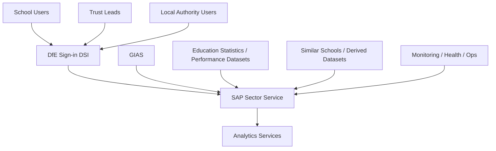
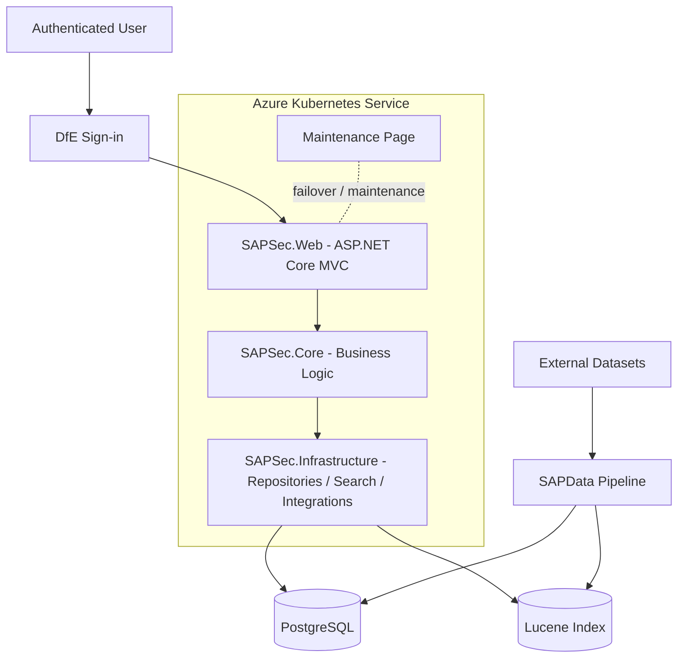
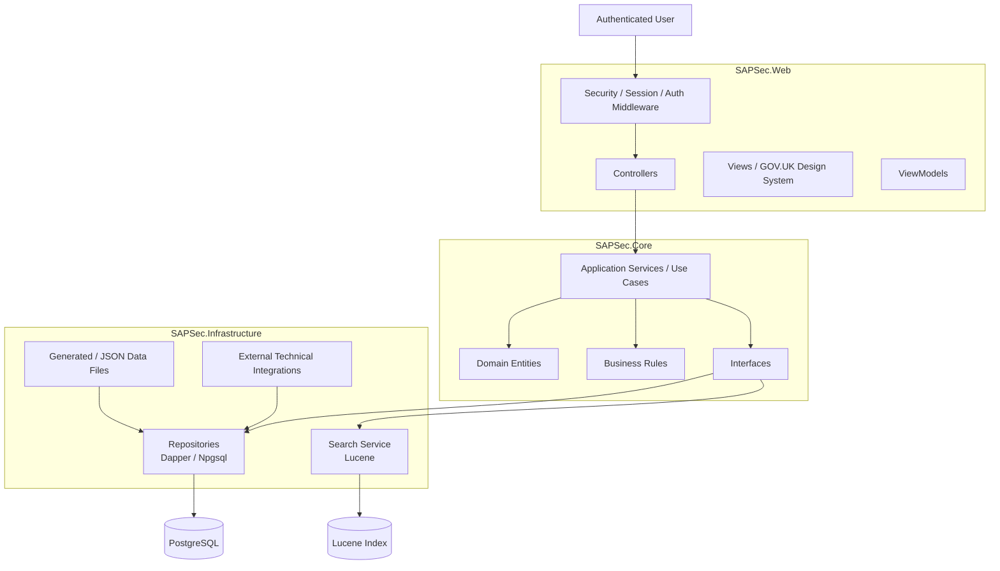
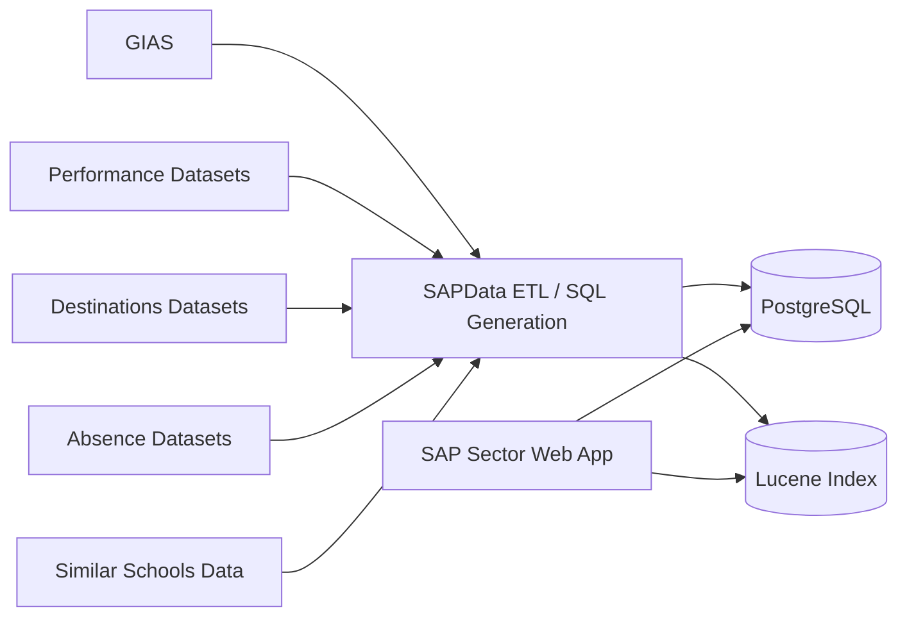

# SAP Sector  
## High-Level Design (HLD)

**Repository:** `DFE-Digital/sap-sector`  
**Author:** Hari Dupati  
**Last updated:** 2026-07-19  
**Status:** Draft

---

## Contents

1. [Purpose](#1-purpose)  
2. [Scope](#2-scope)  
3. [Service overview](#3-service-overview)  
4. [Users and user types](#4-users-and-user-types)  
5. [Data and information types](#5-data-and-information-types)  
6. [Data flows](#6-data-flows)  
7. [High-level architecture diagram](#7-high-level-architecture-diagram)  
8. [C4 system diagrams](#8-c4-system-diagrams)  
9. [Interactions and key flows](#9-interactions-and-key-flows)  
10. [Non-functional considerations](#10-non-functional-considerations)  
11. [Assumptions and constraints](#11-assumptions-and-constraints)  
12. [References](#12-references)  
13. [Glossary](#13-glossary)  

---

## 1. Purpose

This High-Level Design (HLD) provides an overview of the **SAP Sector** service and the supporting data platform contained in the `DFE-Digital/sap-sector` repository.

It explains:

- the main system components
- how users access the service
- how data enters and moves through the platform
- how the application is structured at a high level
- the supporting operational and technical services required for the platform to run

The aim is to give both technical and non-technical readers a clear understanding of the system boundary, architecture, data flows, and operational model.

---

## 2. Scope

### In scope

- user types and access patterns
- service components and responsibilities
- application layers and dependencies
- primary data stores
- search subsystem
- authentication and security boundaries
- high-level interaction flows
- data ingestion and supporting pipeline
- hosting and operational model
- C4-style architectural views

### Out of scope

- low-level design and class-level implementation
- full database schema / detailed ERD
- detailed Terraform or Kubernetes resource definitions
- full CI/CD implementation detail
- code-level API signatures and internal method design

---

## 3. Service overview

SAP Sector is a **sector-facing school information service** built using **ASP.NET Core MVC on .NET 8**.

At a high level, the service enables authenticated users to:

- search for schools
- view establishment information
- view performance and related statistical information
- compare schools using derived and curated data

The repository contains both the application runtime and the supporting data-processing capabilities needed to provide this functionality.

The solution is structured into distinct logical areas:

- **SAPSec.Web** – presentation layer and HTTP entry point
- **SAPSec.Core** – business rules, domain logic, and abstractions
- **SAPSec.Infrastructure** – persistence, search, and technical integrations
- **SAPData** – data ingestion, SQL generation, and database-refresh pipeline
- **Tests** – unit, integration, end-to-end, UI, and accessibility testing
- **terraform** – infrastructure-as-code for deployment and hosting
- **maintenance_page** – static maintenance/failover page

### Architectural summary

- **Upstream data inputs** provide establishment and education-related datasets
- **The data pipeline** downloads, normalises, and prepares data for use by the service
- **PostgreSQL** acts as the authoritative data store
- **Lucene** provides a derived search index
- **ASP.NET Core MVC** delivers the user-facing application
- **DfE Sign-in (DSI)** provides authentication
- **AKS** provides cloud hosting and deployment infrastructure

---

## 4. Users and user types

The architecture and service design indicate the following main user groups:

- **School users**
- **Trust leads**
- **Local authority users**
- **Operational/support users**

### Authentication model

Users access the platform through **DfE Sign-in (DSI)**.

The current application configuration applies a **fallback authorization policy requiring authenticated users** by default. This means the service should be treated as primarily authenticated, with only explicitly allowed endpoints exposed anonymously where needed.

### Operational users

Operational and engineering users interact with the service indirectly via:

- deployment workflows
- monitoring
- health checks
- logs
- maintenance controls
- data pipeline operations

---

## 5. Data and information types

The service uses several different logical categories of data.

### 5.1 Authoritative application data

Stored primarily in **PostgreSQL**, including:

- school and establishment metadata
- performance/statistical data
- comparison-related data
- supporting reference information

### 5.2 Derived search data

Stored in the **Lucene index**, including:

- normalised search terms
- indexed school names
- lookup-friendly derived fields
- search-optimised document structures

### 5.3 Identity and access data

Provided through **DfE Sign-in**, including:

- authenticated identity
- claims
- role or authorization context
- session-related security information

### 5.4 Generated and packaged data files

The repository also contains generated or packaged data assets used by the application and infrastructure layer, including JSON files referenced by `SAPSec.Infrastructure`.

### 5.5 Operational and supporting data

Operational/supporting data includes:

- logs
- health status information
- deployment metadata
- pipeline outputs
- data protection keys for distributed hosting scenarios

---

## 6. Data flows

## 6.1 Data pipeline

The repository includes a substantial supporting data platform under `SAPData/`.

At a high level, the pipeline:

1. acquires raw source files from upstream data sources
2. computes hashes to identify whether data has changed
3. exits early where no changes are detected
4. cleans and normalises source data
5. generates SQL scripts using a .NET-based generator
6. executes SQL to create or refresh the database structures
7. supports downstream application and search capabilities

The `SAPData` README describes a structured **raw → staging → curated** model and a deterministic SQL-generation process.

### Key characteristics

- repeatable
- metadata-driven
- auditable
- SQL-first
- restartable
- suited for scheduled execution

## 6.2 Data flow model

SAP Sector consumes multiple external datasets describing schools, performance, destinations, attendance, and related education metrics.

These datasets are ingested through a structured pipeline and transformed into a consistent form before being loaded into **PostgreSQL**, which acts as the authoritative repository for the service.

Selected fields are then used to build a **Lucene search index** so the web application can support fast and flexible search behaviour.

The application uses:

- **PostgreSQL** for authoritative detail and structured retrieval
- **Lucene** for search-oriented access patterns

## 6.3 High-level data flow summary

- external datasets are downloaded or supplied to the pipeline
- source files are mapped, cleaned, normalised, and transformed
- processed data is loaded into PostgreSQL
- derived search structures are created for Lucene
- the web application queries Lucene for search scenarios
- the web application queries PostgreSQL for authoritative detail and comparison data
- monitoring and operations services observe the running platform

## 6.4 Summary table of data sources and logical domains

| Data Source | Data Domain | Example Fields | Stored In | Downstream Use | Cadence |
|---|---|---|---|---|---|
| GIAS | Establishment metadata | URN, address, governance, phase, trust, local authority | PostgreSQL | Search, detail pages | Daily / scheduled |
| Performance datasets | Attainment and comparison metrics | Attainment 8, Progress 8, subject measures | PostgreSQL | Detail and comparison | Periodic |
| Destinations datasets | Destination outcomes | education, employment, apprenticeships | PostgreSQL | Detail and comparison | Periodic |
| Absence datasets | Attendance/absence | absence %, authorised %, unauthorised % | PostgreSQL | Detail and comparison | Periodic |
| Similar schools data | Comparative cohorts | groupings, peer metrics, derived values | PostgreSQL / generated assets | Comparison | Periodic |
| Derived search data | Search index data | normalised names, compound lookups, indexed fields | Lucene | Search | Rebuilt when needed |
| DSI authentication data | Identity/access context | user identifiers, claims, roles | Runtime/session context | Access control | Runtime |

---

## 7. High-level architecture diagram

The diagram below provides the primary stakeholder-friendly overview of the service. It shows the main user groups, the authentication boundary, the three main application layers, the search and persistence technologies, and the supporting external services and data pipeline.

> Replace the path below with the final exported image location once added to the repository.

*Figure 1. SAP Sector high-level architecture overview.*

### Diagram explanation

At the top of the architecture are the main sector-facing user groups: **school users**, **trust leads**, and **local authority users**. These users authenticate through **DfE Sign-in (DSI)** before reaching the application.

The runtime application is hosted in **Azure Kubernetes Service (AKS)** and is structured into three logical layers:

- **SAPSec.Web** – the ASP.NET Core MVC web layer containing controllers, views, and view models
- **SAPSec.Core** – the business logic layer containing application services, domain entities, and interfaces
- **SAPSec.Infrastructure** – the persistence and integration layer containing repositories, search services, and external integrations

Below these layers sit the main technical dependencies:

- **PostgreSQL** as the primary authoritative database
- **Lucene** as the derived search index
- **data protection key storage** for secure distributed operation

The architecture also includes the **SAPData ETL pipeline**, which loads and transforms external data sources such as **GIAS** and education statistics datasets for downstream use by the service.

Supporting integrations such as analytics and monitoring sit around the application and provide operational visibility and reporting capability.

---

## 8. C4 system diagrams

This section provides C4-style views of the system at different levels of abstraction.

---

## 8.1 C4 Level 1 – System Context

The system context view shows SAP Sector in its wider ecosystem, including users, authentication, upstream data sources, and external supporting services.

*Figure 2. C4 Level 1 – System Context.*

### Context explanation

This view shows SAP Sector as the central service. Users reach it through DfE Sign-in, while upstream educational datasets feed the platform through its supporting data processes. Monitoring and analytics sit outside the core system boundary but are important operational dependencies.

---

## 8.2 C4 Level 2 – Container Diagram

This view breaks the service into its main runtime and supporting containers.

*Figure 3. C4 Level 2 – Container Diagram.*

### Container explanation

This view shows the main deployable and logical containers:

- the **web application**
- the **business logic layer**
- the **infrastructure layer**
- the **database**
- the **search index**
- the **data pipeline**
- the **maintenance page**

The web application handles requests, the core layer applies rules, and the infrastructure layer handles technical integration with PostgreSQL and Lucene.

---

## 8.3 C4 Level 3 – Component Diagram

This view describes the main internal components within the application.

*Figure 4. C4 Level 3 – Component Diagram.*

### Component explanation

This view shows how responsibilities are separated inside the application:

- **Controllers** coordinate incoming requests
- **Views** and **ViewModels** shape the UI
- **Application services** and **use cases** implement business behaviour
- **Interfaces** define abstractions between core and infrastructure
- **Repositories** provide data access to PostgreSQL
- **Search services** provide Lucene-backed searching

This layered structure helps maintain separation of concerns and keeps technical implementation details out of the business logic.

---

## 8.4 High-level data flow diagram

This diagram focuses specifically on how external data moves into the platform and is then consumed by the service.

*Figure 5. High-level data flow diagram.*

### Data flow explanation

This view shows the service’s dual data-consumption model:

- **PostgreSQL** provides authoritative structured data
- **Lucene** provides fast search capability

Both are fed by the supporting data ingestion and transformation process.

---

## 9. Interactions and key flows

### 9.1 Search schools

1. user authenticates through DfE Sign-in
2. user enters search criteria
3. request is received by the web application
4. application logic delegates search to the infrastructure search service
5. Lucene returns matching results
6. results are displayed to the user

### 9.2 View school details

1. user requests a school detail page
2. controller receives the request
3. application logic identifies the required entity/data
4. infrastructure repositories query PostgreSQL
5. view model is assembled
6. details page is rendered

### 9.3 Compare schools

1. user requests a comparison journey
2. business logic determines the comparison context and required data
3. repositories retrieve structured data and derived comparison information
4. comparison outputs are rendered in the web application

### 9.4 Authentication and protected access

1. user attempts to access the service
2. DfE Sign-in authenticates identity
3. claims and authorization context are established
4. the application applies authorization rules before allowing access to protected routes

### 9.5 Operational health and deployment flow

1. deployment pipeline builds and deploys the application
2. health endpoints are called to verify runtime readiness
3. monitoring and support tooling use these signals to determine service health
4. maintenance mode/failover content may be used during operational events

---

## 10. Non-functional considerations

### 10.1 Security

- DfE Sign-in used for authentication
- ASP.NET Core authorization policies applied
- secure session and cookie handling
- anti-forgery protections configured
- Content Security Policy applied through middleware
- data protection keys managed for distributed deployments
- separation of business logic and infrastructure reduces accidental exposure of technical concerns

### 10.2 Performance

- Lucene supports efficient search workloads
- PostgreSQL provides structured and authoritative retrieval
- layered separation supports focused performance tuning
- frontend assets are built and served in a predictable way

### 10.3 Availability

- service runs on AKS
- health endpoints support runtime verification
- review/deployment workflows support controlled release
- maintenance page supports operational continuity during maintenance or failover scenarios

### 10.4 Maintainability

- project is separated into Web, Core, Infrastructure, and Data concerns
- testing strategy covers unit, integration, UI, end-to-end, and accessibility levels
- repository includes architecture and developer guidance to support consistency

### 10.5 Observability

- structured logging support is configured through Serilog, logit.io.
- monitoring and health endpoints are available
- analytics integration exists for service insight and behaviour tracking

---

## 11. Assumptions and constraints

- PostgreSQL is the authoritative structured data store
- search schema changes may require reindexing
- the service is primarily authenticated
- upstream dataset availability and quality affect downstream outputs
- the repo contains both runtime service code and supporting data-pipeline concerns
- some data refresh cadences are dataset-dependent rather than uniform

---

## 12. References

### Repository documents

- `README.md`
- `SAPData/README.md`
- `maintenance_page/README.md`
- `docs/developers/project-structure.md`
- `docs/developers/authentication.md`
- `docs/developers/search-lucene.md`
- `docs/developers/testing.md`

### Key code/configuration references

- `SAPSec.Web/Program.cs`
- `SAPSec.Web/package.json`
- `SAPSec.Infrastructure/SAPSec.Infrastructure.csproj`

### Workflow references

- `.github/workflows/build-and-deploy.yml`
- `.github/workflows/data-pipeline.yml`
- `.github/workflows/delete-review-app.yml`
- `.github/workflows/toggle-maintenance-page.yml`

### Additional supporting areas

- `terraform/`
- `Tests/`
- `docs/adrs/`

---

## 13. Glossary

### SAP Sector
The sector-facing service described in this document.

### SAPSec.Web
The ASP.NET Core MVC web application that handles requests, rendering, sessions, authentication integration, and user-facing behaviour.

### SAPSec.Core
The business logic layer containing domain entities, use cases, rules, interfaces, and application services.

### SAPSec.Infrastructure
The technical layer containing repositories, data access logic, Lucene search integration, JSON-backed assets, and supporting technical services.

### SAPData
The data ingestion and SQL-generation part of the repository used to prepare and load data for the service.

### PostgreSQL
The primary relational database used as the authoritative data store.

### Lucene Index
The derived search index used to support fast school search and lookup behaviour.

### DfE Sign-in (DSI)
The authentication system used to establish user identity and access context.

### ETL
Extract, Transform, Load. The process used to acquire, clean, transform, and load external data into the platform.

### GIAS
Get Information About Schools, a government dataset providing school and establishment information.

### Performance datasets
Education-related performance and statistical datasets used to enrich the service.

### Similar schools data
Derived or supplied comparison data used to support peer-group and comparison journeys.

### Cadence
The refresh frequency or update schedule of a dataset or derived technical asset.

