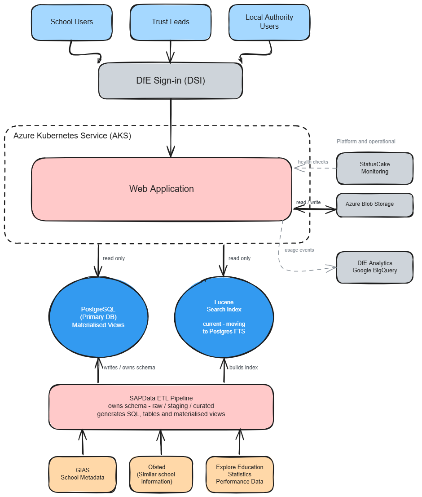
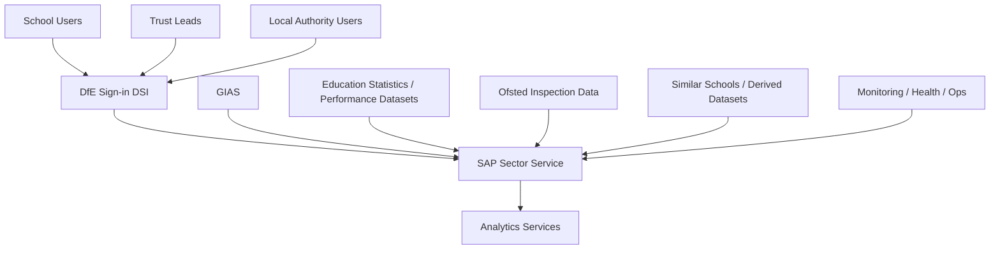
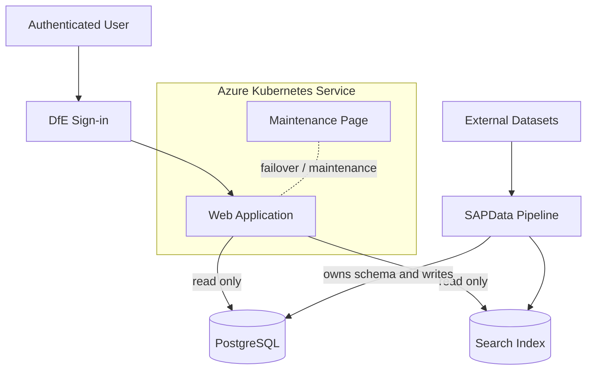
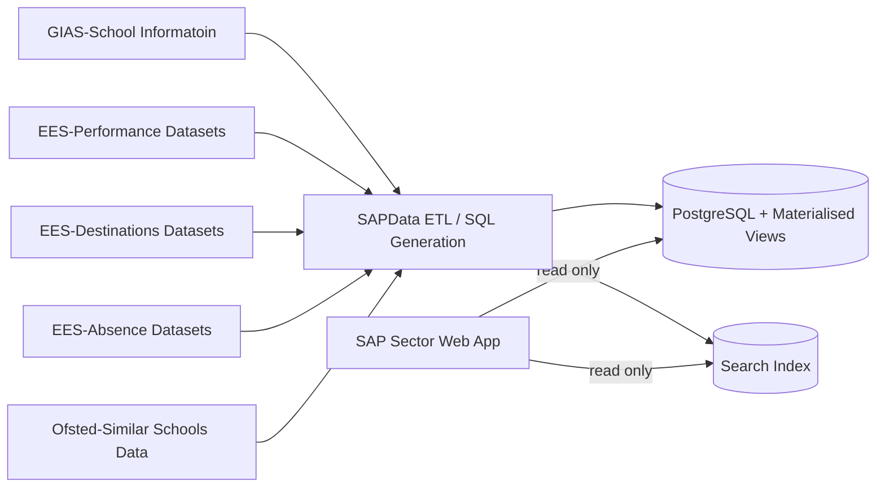

# SAP Sector

## High-Level Design (HLD)

**Repository:** `DFE-Digital/sap-sector`
**Author:** Hari Dupati
**Last updated:** 2026-08-20
**Status:** Draft

---

## Contents

1. [Purpose](#1-purpose)
2. [Scope](#2-scope)
3. [Service overview](#3-service-overview)
4. [Users and user types](#4-users-and-user-types)
5. [Data and information types](#5-data-and-information-types)
6. [Data flows](#6-data-flows)
7. [High-level architecture diagram](#7-high-level-architecture-diagram)
8. [C4 system diagrams](#8-c4-system-diagrams)
9. [Interactions and key flows](#9-interactions-and-key-flows)
10. [Non-functional considerations](#10-non-functional-considerations)
11. [Assumptions and constraints](#11-assumptions-and-constraints)
12. [References](#12-references)
13. [Glossary](#13-glossary)

---

## 1. Purpose

This document gives an overview of the SAP Sector service and the data platform that supports it, both of which live in the `DFE-Digital/sap-sector` repository.

It covers:

- the main components and where the system boundary sits
- how users get access
- how data enters the platform, how it is defined, and how it is retrieved
- the operational and technical services the platform needs to run

It stays above the level of code. Anything that describes .NET implementation structure, such as projects, layers, classes or method signatures, is in the [Low-Level Design (LLD)](./low-level-design.md).

The aim is that both technical and non-technical readers can understand the system boundary, the architecture, the data flows and the operational model.

---

## 2. Scope

### In scope

- user types and access patterns
- system components and what each is responsible for, at a logical level
- data ownership, definition and access
- primary data stores
- the search subsystem and where it is heading
- authentication and security boundaries
- high-level interaction flows
- data ingestion and the supporting pipeline
- hosting and operational model
- C4 views at levels 1 and 2

### Out of scope

These are covered in the [LLD](./low-level-design.md) and the [ERD](./entity-relationship-diagram.md):

- application project structure, layers and internal components
- class-level implementation, patterns and API signatures
- C4 level 3 component views
- full database schema, materialised view definitions and the detailed ERD
- Terraform and Kubernetes resource definitions
- CI/CD implementation detail

---

## 3. Service overview

SAP Sector is a sector-facing school information service.

It lets authenticated users:

- search for schools
- view establishment information
- view performance and related statistical information
- compare schools using derived and curated data

The repository holds both the application runtime and the data processing that supports it.

### Logical building blocks

| Building block        | Responsibility                                                                              |
| --------------------- | -------------------------------------------------------------------------------------------- |
| Web application       | Sector-facing entry point. Renders search, detail and comparison journeys. Read-only.          |
| Data pipeline         | Acquires, normalises and loads external datasets. Owns and refreshes the database structure.   |
| PostgreSQL            | Authoritative store for curated data, exposed to the application through materialised views.   |
| Search index          | Derived index that supports search journeys. Currently Lucene, see section 5.3.                |
| DfE Sign-in (DSI)     | Authentication and identity.                                                                   |
| AKS                   | Container hosting and deployment.                                                              |

How the web application and the pipeline are structured internally is in the [LLD](./low-level-design.md).

### Architectural summary

- upstream data inputs provide establishment and education-related datasets
- the data pipeline downloads, normalises and prepares that data, and is the only thing that writes to the database
- PostgreSQL is the authoritative data store
- a derived search index supports search journeys
- the web application delivers the user-facing experience and only reads data
- DfE Sign-in provides authentication
- AKS provides hosting and deployment

---

## 4. Users and user types

The main user groups are:

- school users
- trust leads
- local authority users
- operational and support users

### Authentication model

Users get to the platform through DfE Sign-in.

The application applies a fallback authorization policy that requires an authenticated user by default. The service should be treated as authenticated throughout, with only specific endpoints opened up anonymously where that is needed.

### Operational users

Operational and engineering users interact with the service indirectly, through:

- deployment workflows
- monitoring
- health checks
- logs
- maintenance controls
- data pipeline operations

---

## 5. Data and information types

### 5.1 Data ownership and access model

This section explains how data definition, persistence and retrieval work. The approach is different from most other services in the portfolio, so it is set out here rather than left to the LLD.

The pipeline owns the schema. The application only reads.

| Concern           | Owned by           | Notes                                                                        |
| ----------------- | ------------------ | ---------------------------------------------------------------------------- |
| Schema definition | Data pipeline      | Tables and materialised views are generated deterministically from metadata.  |
| Writes            | Data pipeline      | The application does no inserts, updates or deletes.                          |
| Reads             | Web application    | Read-only queries issued through Dapper.                                      |
| Query surface     | Materialised views | The application queries views, not base tables.                               |

What follows from that:

**There is no ORM and no EF Core code-first model.** The application does not use entity tracking, lazy loading, navigation properties or EF-managed migrations. Some EF Core elements exist in the codebase, but the data access path does not depend on them.

**Read models are generated rather than hand-written.** A JSON description of each view's shape is produced, and the read model is generated from that serialised structure. This keeps the model in step with the views the pipeline produces.

**Relationships are resolved in the data layer, not at runtime.** Because the query surface is a set of materialised views, the joins and relationships are already worked out when the view is built. The application does not walk an object graph to put a page together.

**Schema change is a pipeline concern.** A change to the shape of the data is made in the pipeline metadata, which flows through to regenerated SQL, refreshed views and regenerated read models. There is no runtime migration step in the application.

Why it is done this way:

- the workload is read-heavy and read-only, so ORM change tracking adds cost without giving anything back
- pre-shaped materialised views give predictable query performance for detail and comparison pages, which would otherwise need wide multi-table joins
- generating the schema deterministically from metadata makes data refreshes repeatable and auditable
- keeping writes out of the runtime removes a class of runtime failure, and means application deployment does not depend on data refresh

The view definitions, the generated model structure and the query patterns are in the [LLD](./low-level-design.md) and the [ERD](./entity-relationship-diagram.md).

### 5.2 Authoritative application data

Held in PostgreSQL:

- school and establishment metadata
- performance and statistical data
- comparison data
- supporting reference information

### 5.3 Search data and direction of travel

Search currently runs on a Lucene index, which holds:

- normalised search terms
- indexed school names
- lookup-friendly derived fields
- search-optimised document structures

The plan is to retire the separate Lucene index and move to PostgreSQL full-text search, in line with what SAP Public are doing. That removes a second data store and the reindexing that goes with it, and puts everything on one query surface. Lucene should be read as the current implementation rather than the target.

### 5.4 Identity and access data

Comes from DfE Sign-in:

- authenticated identity
- claims
- role and authorization context
- session-related security information

### 5.5 Generated and packaged data files

The repository also holds generated and packaged data assets used at runtime, including the JSON structures that read models are generated from. See section 5.1.

### 5.6 Operational and supporting data

- logs
- health status information
- deployment metadata
- pipeline outputs
- data protection keys for distributed hosting

---

## 6. Data flows

## 6.1 Data pipeline

The supporting data platform sits under `SAPData/`.

The pipeline:

1. acquires raw source files from upstream data sources
2. computes hashes to work out whether the data has changed
3. exits early where nothing has changed
4. cleans and normalises the source data
5. generates SQL from metadata and source structures
6. runs that SQL to create or refresh tables and materialised views
7. supports the application and search on the other side

It follows a raw, staging and curated model, with a deterministic SQL generation process.

### Key characteristics

- repeatable
- metadata-driven
- auditable
- SQL-first
- restartable
- suited to running on a schedule

## 6.2 Data flow model

SAP Sector uses several external datasets covering schools, performance, destinations, attendance, inspection outcomes and related education metrics.

These are ingested through the pipeline and transformed into a consistent form before being loaded into PostgreSQL, which is the authoritative store for the service.

Curated data is then shaped into materialised views, which are the query surface for the application. Selected fields are also used to build the search index.

## 6.3 High-level data flow summary

- external datasets are downloaded or supplied to the pipeline
- source files are mapped, cleaned, normalised and transformed
- processed data is loaded into PostgreSQL
- materialised views are built to serve the application's query patterns
- derived search structures are created for the search index
- the web application issues read-only queries against materialised views
- the web application queries the search index for search journeys
- monitoring and operations services watch the running platform

## 6.4 Summary table of data sources and logical domains

| Data source             | Data domain                       | Example fields                                          | Stored in                     | Downstream use          | Cadence             |
| ----------------------- | --------------------------------- | ------------------------------------------------------- | ----------------------------- | ----------------------- | ------------------- |
| GIAS                    | Establishment metadata            | URN, address, governance, phase, trust, local authority | PostgreSQL                    | Search, detail pages    | Daily or scheduled  |
| EES                     | Attainment and comparison metrics | Attainment 8, Progress 8, subject measures              | PostgreSQL                    | Detail and comparison   | Periodic            |
| EES                     | Destination outcomes              | education, employment, apprenticeships                  | PostgreSQL                    | Detail and comparison   | Periodic            |
| EES                     | Attendance and absence            | absence %, authorised %, unauthorised %                 | PostgreSQL                    | Detail and comparison   | Periodic            |
| Ofsted                  | Comparative cohorts               | groupings, peer metrics, derived values                 | PostgreSQL, generated assets  | Comparison              | Periodic            |
| Derived search data     | Search index data                 | normalised names, compound lookups, indexed fields      | Search index                  | Search                  | Rebuilt when needed |
| DSI authentication data | Identity and access context       | user identifiers, claims, roles                         | Runtime and session context   | Access control          | Runtime             |

### Note on Ofsted

The service does not integrate directly with Ofsted systems. Ofsted inspection data is relied on indirectly. It comes through upstream departmental datasets and feeds the similar schools comparison journey. Ofsted is therefore an upstream data dependency rather than a runtime integration, and changes to how Ofsted publish or structure judgements will affect comparison outputs.

---

## 7. High-level architecture diagram

The diagram below is the main stakeholder-facing view of the service. It shows the user groups, the authentication boundary, the hosted application, the search and persistence technologies, the supporting services and the data pipeline.

*Figure 1. SAP Sector high-level architecture overview.*

### Diagram explanation

At the top are the main sector-facing user groups: school users, trust leads and local authority users. They authenticate through DfE Sign-in before reaching the application.

The runtime application is hosted in Azure Kubernetes Service and is shown as a single web application. How it is layered internally is an implementation concern and is covered in the [LLD](./low-level-design.md).

Below it are the two data stores the service uses:

- PostgreSQL, the authoritative database, queried read-only through materialised views
- the search index, which supports search journeys

Down the right-hand side are the platform and operational dependencies: StatusCake for monitoring, Azure Blob Storage for data protection keys, and DfE Analytics for usage events.

The SAPData pipeline sits at the bottom. It loads and transforms external sources including GIAS, Ofsted inspection data and education statistics, and it owns the database structure.

---

## 8. C4 system diagrams

This section gives C4 views at levels 1 and 2. The level 3 component view is in the [LLD](./low-level-design.md), because it describes implementation structure.

---

## 8.1 C4 Level 1, system context

The context view shows SAP Sector in its wider setting, including users, authentication, upstream data sources and external supporting services.

*Figure 2. C4 level 1, system context.*

### Context explanation

SAP Sector sits in the middle. Users reach it through DfE Sign-in. Upstream education datasets, including Ofsted inspection outcomes which are consumed indirectly, feed the platform through the data pipeline. Monitoring and analytics sit outside the core system boundary but are still operational dependencies.

---

## 8.2 C4 Level 2, container diagram

This breaks the service into its main runtime and supporting containers.

*Figure 3. C4 level 2, container diagram.*

### Container explanation

The containers are:

- the web application, hosted in AKS
- the database, which the application reads and the pipeline writes
- the search index
- the data pipeline
- the maintenance page

The direction of the arrows matters here. All writes come from the pipeline, and the application's relationship with both stores is read-only. See section 5.1.

---

## 8.3 High-level data flow diagram

This one focuses on how external data gets into the platform and is then used by the service.

*Figure 4. High-level data flow diagram.*

### Data flow explanation

The service reads from two places:

- PostgreSQL for authoritative structured data, through materialised views
- the search index for search

Both are populated by the pipeline, and both are read-only as far as the application is concerned. Moving search onto PostgreSQL full-text search, as described in section 5.3, would take the second store out of this diagram.

---

## 9. Interactions and key flows

These are the journeys and operational flows the service supports. The step-by-step sequences, the responsibilities of each part of the application, and the query detail are in the [LLD](./low-level-design.md).

### 9.1 Search schools

### 9.2 View school details

### 9.3 Compare schools

### 9.4 Similar schools

### 9.5 Authentication and protected access

### 9.6 Operational health and deployment

---

## 10. Non-functional considerations

### 10.1 Security

- DfE Sign-in for authentication
- authorization policies applied, with routes protected by default
- secure session and cookie handling
- anti-forgery protections
- Content Security Policy applied
- data protection keys managed for distributed deployments
- the application has no write permissions on the database, which limits what an application-level compromise could do

### 10.2 Performance

- materialised views give pre-shaped, predictable query performance for detail and comparison pages
- the search index handles search workloads efficiently
- separating the layers makes performance tuning easier to target
- frontend assets are built and served in a predictable way

### 10.3 Availability

- the service runs on AKS
- health endpoints allow runtime verification
- review and deployment workflows support controlled release
- the maintenance page covers maintenance and failover
- application availability does not depend on data refresh, because refreshes are driven by the pipeline

### 10.4 Maintainability

- a clear split between the data platform and the runtime service
- schema change is metadata-driven and deterministic
- testing covers unit, integration, UI, end-to-end and accessibility levels
- the repository holds architecture and developer guidance to keep things consistent

### 10.5 Observability

- structured logging through Serilog and logit.io
- monitoring and health endpoints
- analytics integration for service insight and behaviour tracking

---

## 11. Assumptions and constraints

- PostgreSQL is the authoritative structured data store
- the data pipeline owns the schema and all writes, and the application is read-only
- the application queries materialised views rather than base tables, so query patterns are limited to what the views provide
- read models are generated from serialised view structures rather than written by hand
- search currently runs on a separate Lucene index, so search schema changes need a reindex until the move to PostgreSQL full-text search is done
- the service is authenticated throughout
- upstream dataset availability and quality, including Ofsted publication cycles, affect what the service can show
- the repository holds both runtime service code and data pipeline concerns
- refresh cadences vary by dataset rather than being uniform

---

## 12. References

### Architecture documents

- [`docs/architecture/overview.md`](./overview.md)
- [`docs/architecture/low-level-design.md`](./low-level-design.md)
- [`docs/architecture/entity-relationship-diagram.md`](./entity-relationship-diagram.md)
- [`docs/adrs/`](../adrs/)

### Repository documents

- `README.md`
- `SAPData/README.md`
- `maintenance_page/README.md`
- `docs/developers/project-structure.md`
- `docs/developers/authentication.md`
- `docs/developers/search-lucene.md`
- `docs/developers/testing.md`

### Workflow references

- `.github/workflows/build-and-deploy.yml`
- `.github/workflows/data-pipeline.yml`
- `.github/workflows/delete-review-app.yml`
- `.github/workflows/toggle-maintenance-page.yml`

### Other supporting areas

- `terraform/`
- `Tests/`

---

## 13. Glossary

**SAP Sector.** The sector-facing service described in this document.

**SAPData.** The data ingestion and SQL generation part of the repository. It prepares and loads data for the service and owns the database structure.

**PostgreSQL.** The relational database used as the authoritative data store.

**Materialised view.** A stored, pre-computed result set built by the pipeline. Materialised views are the query surface the application uses, with relationships already resolved.

**Dapper.** The lightweight data access library used to issue read-only queries against materialised views. Used instead of an ORM because the application does not write data or manage schema.

**Search index.** The derived index that supports search journeys. Currently Lucene, with a planned move to PostgreSQL full-text search.

**DfE Sign-in (DSI).** The authentication system used to establish user identity and access context.

**ETL.** Extract, transform, load. The process used to acquire, clean, transform and load external data into the platform.

**GIAS.** Get Information About Schools, a government dataset holding school and establishment information.

**Ofsted.** The Office for Standards in Education, Children's Services and Skills. 

**Performance datasets.** Education performance and statistical datasets used to enrich the service.

**Similar schools data.** Derived or supplied comparison data that supports peer group and comparison journeys.

**Cadence.** How often a dataset or derived technical asset is refreshed.
