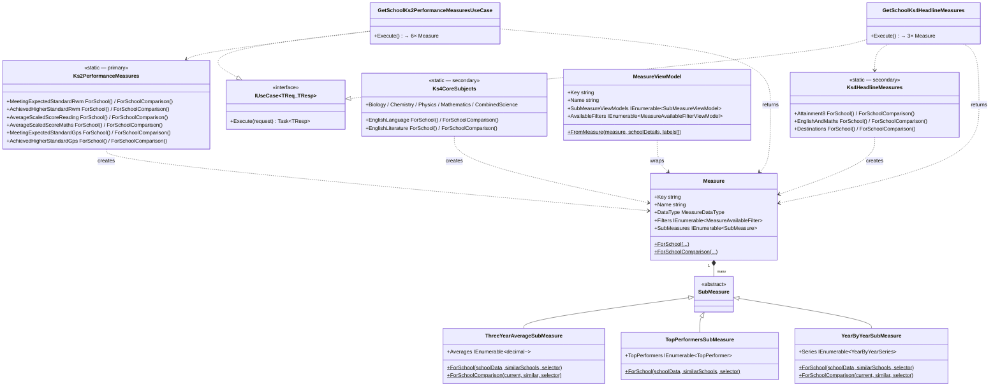

# SAP Sector — Low-Level Design (LLD)

**Repository:** `DFE-Digital/sap-sector`
**Author:** Hari Dupati
**Last updated:** 2026-08-11
**Status:** Draft
**Relates to:** `docs/architecture/high-level-design.md`

---

## Contents

1. [Purpose and scope](#1-purpose-and-scope)
2. [Route map](#2-route-map)
3. [Authentication and authorisation](#3-authentication-and-authorisation)
4. [Search and phase routing](#4-search-and-phase-routing)
5. [Feature flag behaviour](#5-feature-flag-behaviour)
6. [Example request flow — KS2 performance page](#6-example-request-flow--ks2-performance-page)
7. [Controllers](#7-controllers)
8. [Measure components and ViewModels ](#8-measure-components-and-viewmodels)
9. [Use cases and business rules](#9-use-cases-and-business-rules)
10. [Performance measures domain model](#10-performance-measures-domain-model)
11. [Repositories and data sources](#11-repositories-and-data-sources)
12. [Error handling](#12-error-handling)
13. [School layout and side navigation](#13-school-layout-and-side-navigation)
14. [Data pipeline dependency](#14-data-pipeline-dependency)
15. [Test coverage](#15-test-coverage)
16. [Phase comparison and refactoring notes](#16-phase-comparison-and-refactoring-notes)
17. [Class diagrams](#17-class-diagrams)

---

## 1. Purpose and scope

This document covers the low-level design of the SAP Sector service. The layered architecture, authentication, search pipeline, middleware, error handling, and testing patterns.

---

## 2. Route map

Route helpers: `Routes.PrimarySchool(urn)` and `Routes.SecondarySchool(urn)` return typed instances. After search, `SchoolSearchController.BuildSchoolUrl()` selects the correct base path using `PhaseOfEducationValues.IsPrimaryOrAllThrough(phase)`.

### Primary — `/school/primary/{urn}`

| Route | Action |
|---|---|
| `/school/primary/{urn}` | `Index` — overview |
| `/school/primary/{urn}/ks2` | `Ks2PerformanceMeasures` |
| `/school/primary/{urn}/attendance` | `Attendance` |
| `/school/primary/{urn}/view-similar-schools` | `ViewSimilarSchools` |
| `/school/primary/{urn}/school-details` | `SchoolDetails` |
| `/school/primary/{urn}/what-is-a-similar-school` | `WhatIsASimilarSchool` |
| `/school/primary/{urn}/view-similar-schools/{similarUrn}` | Comparison `Similarity` |
| `/school/primary/{urn}/view-similar-schools/{similarUrn}/ks2` | Comparison `Ks2` |
| `/school/primary/{urn}/view-similar-schools/{similarUrn}/attendance` | Comparison `Attendance` |
| `/school/primary/{urn}/view-similar-schools/{similarUrn}/school-details` | Comparison `SchoolDetails` |

### Secondary — `/school/secondary/{urn}`

| Route | Action |
|---|---|
| `/school/secondary/{urn}` | `Index` — overview |
| `/school/secondary/{urn}/ks4-headline-measures` | `Ks4HeadlineMeasures` |
| `/school/secondary/{urn}/ks4-headline-measures/data` | `Ks4HeadlineMeasuresData`  |
| `/school/secondary/{urn}/ks4-core-subjects` | `Ks4CoreSubjects` |
| `/school/secondary/{urn}/ks4-core-subjects/data` | `Ks4CoreSubjectsData`  |
| `/school/secondary/{urn}/attendance` | `Attendance` |
| `/school/secondary/{urn}/attendance-data` | `AttendanceData` (JSON) |
| `/school/secondary/{urn}/ks4-destinations/data` | `Ks4DestinationsData` (JSON) |
| `/school/secondary/{urn}/view-similar-schools` | `ViewSimilarSchools` |
| `/school/secondary/{urn}/school-details` | `SchoolDetails` |
| `/school/secondary/{urn}/what-is-a-similar-school` | `WhatIsASimilarSchool` |
| `/school/secondary/{urn}/view-similar-schools/{similarUrn}` | Comparison `Similarity` |
| `/school/secondary/{urn}/view-similar-schools/{similarUrn}/ks4-headline-measures` | Comparison `Ks4HeadlineMeasures` |
| `/school/secondary/{urn}/view-similar-schools/{similarUrn}/ks4-core-subjects` | Comparison `Ks4CoreSubjects` |
| `/school/secondary/{urn}/view-similar-schools/{similarUrn}/attendance` | Comparison `Attendance` |
| `/school/secondary/{urn}/view-similar-schools/{similarUrn}/school-details` | Comparison `SchoolDetails` |

---

## 3. Authentication and authorisation

Authentication uses the **OIDC Authorization Code flow** via `Microsoft.AspNetCore.Authentication.OpenIdConnect` against **DfE Sign-in (DSI)**. See `docs/adrs/009-authentication-provider.md`.

Every controller action across both phases carries `[Authorize]`, enforcing the global DSI policy. Users without an organisation claim (not linked to a school or trust in DSI) are redirected to `/error/403` with a prompt to link their DSI account.

Key config (`appsettings.json` section `"DsiConfiguration"`): `Authority`, `ClientId`, `ClientSecret`, `MetadataAddress`, `TokenExpiryMinutes` (default 60). Cookie name: `SAPSec.Auth`; sliding expiration; HttpOnly; SecureAlways.

**OIDC event handlers** (`DsiAuthenticationHandler`):

| Event | Purpose |
|---|---|
| `OnTokenValidated` | Enriches claims; sets organisation context |
| `OnRemoteFailure` / `OnAuthenticationFailed` | Redirects to `/error` and logs |
| `OnSignedOutCallbackRedirect` | Redirects to `/` after sign-out |

For UI and integration tests, `AutoAuthenticationHandler` bypasses DSI and injects a fixed test identity with `sub`, `email`, and `organisation` claims.

---

## 4. Search and phase routing

`SchoolSearchService` checks the `EnablePrimarySchools` flag before including primary/all-through schools in results. The core eligibility logic is in `EstablishmentExtensions.CanSearch(establishment, primaryEnabled)`:

- Phase ID `2` (Primary) or `7` (All-through) — included **only if flag is on**
- Phase ID `4` (Secondary) — always included
- Establishment status `Closed` or `ProposedToOpen` — excluded regardless

After a match is found, `BuildSchoolUrl()` routes by phase:

```csharp
PhaseOfEducationValues.IsPrimaryOrAllThrough(phaseOfEducationName)
    ? Routes.PrimarySchool(urn).Overview   // → /school/primary/{urn}
    : Routes.SecondarySchool(urn).Overview // → /school/secondary/{urn}
```

The Lucene index stores `urn`, `establishmentName`, `street`, and `postcode`. The last query token uses `PrefixQuery` for typeahead; middle tokens use `TermQuery` (MUST). Phrase and exact-name boosts are applied. Primary schools are **always indexed** regardless of the feature flag — `CanIndexForSearch()` is flag-unaware. See `docs/developers/search-lucene.md` for full details.

---

## 5. Feature flag behaviour

Flag: `FeatureFlags.EnablePrimarySchools = "EnablePrimarySchools"` via `Microsoft.FeatureManagement`. Secondary has no equivalent flag.

| Component | When flag is OFF |
|---|---|
| `[RequireFeatureFlagFilter]` on primary controllers | HTTP 404 for all primary pages |
| `SchoolSearchService.SearchAsync()` | Primary/all-through schools excluded |
| `SchoolSearchService.SearchByNumberAsync()` | Returns `null` for primary URNs |
| Lucene index | Primary schools remain indexed |

Integration tests verify via `Fixture.FeatureFlagService.Override(FeatureFlags.EnablePrimarySchools, false)`.

---

## 6. Example request flow — KS2 performance page

This traces `GET /school/primary/{urn}/ks2` — the most representative flow for the new `Measure`-based pattern.

```
[Authorize]               → DSI cookie valid? proceed | absent → 401
[RequireFeatureFlag]      → flag on? proceed | off → 404
[RequireSchoolPhase]      → Primary/All-through URN? proceed
                          → Secondary URN? redirect to SecondarySchool(urn).Overview
                          → not found? → 404

SchoolController.Ks2PerformanceMeasures(urn)
  └─ filters = Request.Query.ToDictionary()
  └─ GetSchoolKs2PerformanceMeasuresUseCase.Execute(new(urn, filters))
       └─ PrimarySimilarSchoolsPerformanceDataProvider
            ├─ ISimilarSchoolsPrimaryRepository.GetGroupAsync(urn)
            │    → v_similar_schools_primary_groups
            ├─ IEstablishmentRepository.GetEstablishmentsAsync(urn + neighbourUrns)
            │    → v_establishment
            └─ IKs2PerformanceRepository.GetByUrnsAsync(allUrns)
                 → JsonKs2PerformanceRepository
                   (establishment_performance.json, la_performance.json,
                    england_performance.json)
       └─ Ks2PerformanceMeasures.*.ForSchool(currentSchool, similarSchools, filters)
            → 6× Measure (each containing ThreeYearAverage,
                          TopPerformers, YearByYear SubMeasures)

  └─ Ks2MeasuresPageViewModel { School, 6× MeasureViewModel.FromMeasure(...) }
  └─ View("Ks2PerformanceMeasures")
       → renders _Measure partial per measure
       → each _Measure uses <tabbed-view> tag helper for chart/table tabs
       → filter <select> elements use measure-filters.js for AJAX partial refresh
```

---

## 7. Controllers

Both phases use the same structural approach: `[Authorize]`, `[RequireSchoolPhase]`, use-case injection, `PopulateViewData()`/`SetSchoolViewData()`, and `MeasureViewModel` mapping.

### Primary `SchoolController` — `[Route("school/primary/{urn}")]`

Additional filters: `[RequireFeatureFlag(FeatureFlags.EnablePrimarySchools)]`, `[RequireSchoolPhase(ExpectedSchoolPhase.Primary)]`.

| Action | Route suffix | Returns |
|---|---|---|
| `Index` | *(none)* | `SchoolInfoViewModel` |
| `Ks2PerformanceMeasures` | `/ks2` | `Ks2MeasuresPageViewModel` (6× `MeasureViewModel`) |
| `Attendance` | `/attendance` | `AttendanceMeasuresPageViewModel` |
| `ViewSimilarSchools` | `/view-similar-schools` | `PrimarySimilarSchoolsPageViewModel` |
| `SchoolDetails` | `/school-details` | via `IRequestSchoolAccessor` |
| `WhatIsASimilarSchool` | `/what-is-a-similar-school` | `SchoolInfoViewModel` |

### Secondary `SchoolController` — `[Route("school/secondary/{urn}")]`

Filter: `[RequireSchoolPhase(ExpectedSchoolPhase.Secondary)]`. No feature flag filter.

| Action | Route suffix | Returns |
|---|---|---|
| `Index` | *(none)* | `SchoolDetails` via `IRequestSchoolAccessor` |
| `Ks4HeadlineMeasures` | `/ks4-headline-measures` | `Ks4HeadlineMeasuresPageViewModel` |
| `Ks4HeadlineMeasuresData` | `/ks4-headline-measures/data` | JSON  |
| `Ks4CoreSubjects` | `/ks4-core-subjects` | `Ks4CoreSubjectsPageViewModel` |
| `Ks4CoreSubjectsData` | `/ks4-core-subjects/data` | JSON  |
| `Attendance` | `/attendance` | `SchoolAttendancePageViewModel` |
| `AttendanceData` | `/attendance-data` | JSON |
| `SchoolDetails` | `/school-details` | via `IRequestSchoolAccessor` |
| `WhatIsASimilarSchool` | `/what-is-a-similar-school` | via `IRequestSchoolAccessor` |

### Comparison controllers

Both phases have a `SimilarSchoolsComparisonController`. Primary uses `[RequireSchoolPhase]` on **both** `urn` and `similarSchoolUrn`. Secondary applies it to the current school only.

| | Primary | Secondary |
|---|---|---|
| Base route | `/school/primary/{urn}/view-similar-schools/{similarUrn}` | `/school/secondary/{urn}/view-similar-schools/{similarUrn}` |
| Comparison pages | Similarity, KS2, Attendance, SchoolDetails | Similarity, KS4HeadlineMeasures, KS4CoreSubjects, Attendance, SchoolDetails |
| Measure pattern | `Measure` / `MeasureViewModel` ✅ | Legacy bespoke fields — being refactored |

---

## 8. Measure components and ViewModels

A unified component model that is **live in primary** and **being adopted in secondary**. All new measure work should follow this pattern.

### The `Measure` domain type

```csharp
public record Measure(
    string Key,
    string Name,
    MeasureDataType DataType,
    IEnumerable<MeasureAvailableFilter> Filters,
    IEnumerable<SubMeasure> SubMeasures);
```

Constructed via:
- `Measure.ForSchool(...)` — school page; compares against similar schools average, LA, England
- `Measure.ForSchoolComparison(...)` — comparison page; compares two schools side by side

**SubMeasure types:**

| Type | Content | Included in |
|---|---|---|
| `ThreeYearAverageSubMeasure` | `IEnumerable<decimal?>` — one value per comparator | Both `ForSchool` and `ForSchoolComparison` |
| `TopPerformersSubMeasure` | Top 3 schools by three-year average | `ForSchool` only |
| `YearByYearSubMeasure` | Current/Previous/Previous2 series per comparator | Both |

**`SchoolData`** — the input record that bundles everything a measure needs:

```csharp
internal sealed record SchoolData(
    string Urn,
    string Name,
    Ks4PerformanceData? PerformanceData,
    Ks4DestinationsData? DestinationsData);
```

For primary, `Ks2PerformanceData` is used via `MeasureFieldSelector<Ks2PerformanceData>` in the same way.

### `MeasureViewModel`

Wraps a `Measure` for the view layer. Used by both primary and secondary.

```csharp
MeasureViewModel.FromMeasure(measure, schoolDetails, labels[])
```

Labels are supplied by the controller (e.g. `["School name", "Similar schools average", "Local authority schools average", "Schools in England average"]`).

### View components (partials)

| Partial | Purpose |
|---|---|
| `_Measure` | Renders a complete measure with all its sub-measures as tabs |
| `_MeasureFilters` | Renders filter dropdowns for a measure dynamically |
| `_MeasureThreeYearAverageChart` | Bar chart for the three-year average sub-measure |
| `_MeasureTopPerformers` | Top performers panel |
| `_MeasureYearByYearChart` | Year-by-year line chart |
| `_MeasureTable` | Data table view |

### `<tabbed-view>` tag helper

`TabbedViewTagHelper` + `TabbedContentTagHelper` produce GOV.UK tabs markup from Razor without duplicating tab list and panel structure:

```razor
<tabbed-view html-prefix="attainment8">
  <tab-content id="chart" name="Three year average">...</tab-content>
  <tab-content id="top-performers" name="Top performers">...</tab-content>
  <tab-content id="year-by-year" name="Year by year">...</tab-content>
</tabbed-view>
```

### JavaScript modules

| Module | Purpose |
|---|---|
| `chart-factory.js` | ES module (`init(element)`, `initAll()`); `init` scopes chart setup to a DOM subtree for partial refreshes |
| `measure-filters.js` | Intercepts filter `<select>` changes; fetches updated partial via AJAX; swaps measure section; re-initialises charts and tabs |
| `mobile-collapsed-tabs.js` | Extends GOV.UK `Tabs`; always renders collapsed on mobile; adds `selectTabById()` for tab state restore after partial refresh |

---

## 9. Use cases and business rules

All use cases implement `IUseCase<TRequest, TResponse>` with `Execute(TRequest) → Task<TResponse>`.

**`GetSchoolInfoUseCase`** — used on every page in both phases; fetches school info from `v_establishment`.

### Primary use cases (`SAPSec.Core/Features/Primary/`)

**`GetSchoolKs2PerformanceMeasuresUseCase`**
- Fetches similar-schools group, then KS2 performance for all schools
- Applies `FilterBy` case-insensitively (e.g. subject filter)
- Returns 6 `Measure` objects via `Ks2PerformanceMeasures.*.ForSchool()`

**`GetSchoolKs2PerformanceComparisonUseCase`**
- Fetches only the two schools — no group lookup
- Returns 6 `Measure` objects via `Ks2PerformanceMeasures.*.ForSchoolComparison()`

**`GetSchoolAttendanceMeasuresUseCase`** — returns one `Measure` (overall or persistent absence).

**`FindPrimarySimilarSchoolsUseCase`**
- Loads group + characteristic values
- Applies `SimilarSchoolsFilters`: location, region, urban/rural, school type, admissions, gender, nursery, resourced provision, sixth form, attendance, school characteristics
- Validates filters — returns `ValidationErrors` but renders the page rather than an error
- Sorts by chosen KS2 metric (default `RwmExpected`); tie-breaks on display value then alphabetical
- Paginates to `ResultsPerPage` (default 10); returns all results separately for the map

**Sort options:** `RwmExpected` *(default)*, `RwmHigher`, `ReadingScaledScore`, `MathsScaledScore`, `GpsExpected`, `GpsHigher`

**`GetPrimarySimilarSchoolDetailsUseCase`** — coordinates for both schools and GIAS detail for the similar school.

### Secondary use cases (`SAPSec.Core/Features/Secondary/` and `SAPSec.Core/Features/`)

**`GetSchoolKs4HeadlineMeasures`** — KS4 performance (Attainment 8, English & Maths, Destinations). Currently returns bespoke response record; will be replaced with `Measure`-based response.

**`GetSchoolKs4CoreSubjects`** — 7 subjects (English Language, English Literature, Biology, Chemistry, Physics, Maths, Combined Science) with grade filter (4/5/7). will be replaced with `IReadOnlyCollection<Measure>`.

**`GetFilteredSchoolKs4CoreSubject`** — serves the legacy `/data` JSON endpoints.

**`FindSimilarSchools`** — secondary similar schools. Does **not** implement `IUseCase<T,R>`; uses inline LINQ rather than data providers. Will be refactored to align with `FindPrimarySimilarSchoolsUseCase` pattern.

**`GetSchoolComparisonKs4HeadlineMeasures`** — new use case for comparison page; returns `Measure`-based response.

**`GetSchoolComparisonKs4CoreSubjects`** — new use case for comparison page; returns `IReadOnlyCollection<Measure>`.

**`GetAttendanceMeasures`** — shared across both phases; returns attendance series and top performers.

---

## 10. Performance measures domain model

### Primary — KS2 (`SAPSec.Core/Features/Primary/Ks2PerformanceMeasures.cs`)

Six static inner classes, each with `ForSchool()` and `ForSchoolComparison()`. Uses `MeasureFieldSelector<Ks2PerformanceData>` selecting Current/Previous/Previous2 × Establishment/LA/England.

| Measure | Data type | Subject filter? |
|---|---|---|
| `MeetingExpectedStandardRwm` | `GradePercentage` | Yes — Reading/Writing/Maths/Combined |
| `AchievedHigherStandardRwm` | `GradePercentage` | Yes — Reading/Writing/Maths/Combined |
| `AverageScaledScoreReading` | `ScaledScore` | No |
| `AverageScaledScoreMaths` | `ScaledScore` | No |
| `MeetingExpectedStandardGps` | `GradePercentage` | No |
| `AchievedHigherStandardGps` | `GradePercentage` | No |

### Secondary — KS4 (`SAPSec.Core/Features/Measures/`)

After Secondary school area refactoring, KS4 measures use the same `Measure.ForSchool()` / `ForSchoolComparison()` factory via `SAPSec.Core/Features/Measures/Ks4HeadlineMeasures.cs` and `Ks4CoreSubjects.cs`.

| Namespace | Measures |
|---|---|
| `Ks4HeadlineMeasures` | `Attainment8`, `EnglishAndMaths` (grade 4/5 filter), `Destinations` (all/education/employment filter) |
| `Ks4CoreSubjects` | `EnglishLanguage`, `EnglishLiterature`, `Biology`, `Chemistry`, `Physics`, `Mathematics`, `CombinedScience` — all with grade 4/5/7 filter |

`MeasureHelper` (replaces `Ks4HeadlineMeasuresCalculator`) provides shared `AverageFrom()`, `SeriesFrom()`, `ParseNullableDecimal()`.

---

## 11. Repositories and data sources

### Phase-specific

| Repository | Interface | Views / source | Phase |
|---|---|---|---|
| `PostgresSimilarSchoolsPrimaryRepository` | `ISimilarSchoolsPrimaryRepository` | `v_similar_schools_primary_groups`, `v_similar_schools_primary_values` | Primary |
| `PostgresSimilarSchoolsSecondaryRepository` | `ISimilarSchoolsSecondaryRepository` | `v_similar_schools_secondary_groups`, `v_similar_schools_secondary_values` | Secondary |
| `JsonKs2PerformanceRepository` | `IKs2PerformanceRepository` | JSON files: `establishment_performance.json`, `la_performance.json`, `england_performance.json` | Primary ⚠️ |
| `PostgresKs4PerformanceRepository` | `IKs4PerformanceRepository` | `v_establishment_performance`, `v_la_performance`, `v_england_performance` | Secondary |
| `PostgresKs4DestinationsRepository` | `IKs4DestinationsRepository` | `v_establishment_destinations`, `v_la_destinations`, `v_england_destinations` | Secondary |


### Shared across both phases

`PostgresEstablishmentRepository` → `v_establishment` · `PostgresAbsenceRepository` · `ISchoolDetailsService` · `PostgresEstablishmentEmailRepository`

---

## 12. Error handling

`NotFoundException` thrown by any use case is caught by `NotFoundExceptionHandler` (registered via `services.AddExceptionHandler<NotFoundExceptionHandler>()`):
- Logs a warning
- Sets HTTP 404 and rewrites path to `/error/404`
- In non-production: surfaces `ex.Message` for debugging

`ErrorController` at `[Route("error")]` [AllowAnonymous]: 401/403 → `AccessDenied.cshtml`, 404 → `NotFound.cshtml`, other → `Problem.cshtml`.

Middleware pipeline order (relevant excerpt):
```
UseStatusCodePagesWithReExecute("/error/{0}")
UseDeveloperExceptionPage | UseExceptionHandler  ← triggers NotFoundExceptionHandler
UseMiddleware<SecurityHeadersMiddleware>
UseAuthentication / UseAuthorization
MapControllers
```

---

## 13. School layout and side navigation

Both phases call a `SetSchoolViewData()` / `PopulateViewData()` helper on every action, which sets `ViewData["SchoolNavigation"]` using phase-specific factories:

- `SchoolSideNavigationViewModel.CreatePrimary(Url, urn, actionName)` → Overview, KS2, Attendance, View similar schools, School details
- `SchoolSideNavigationViewModel.CreateSecondary(Url, urn, actionName)` → Overview, KS4 Headline Measures, KS4 Core Subjects, Attendance, View similar schools, School details

Comparison layouts in both phases read `ViewData["ComparisonSchool"]` to render the comparison header and sub-navigation.

---

## 14. Data pipeline dependency

The following assets are **generated by SAPData and packaged into the deployment artefact** — a redeploy is required for updated data:

- KS2 JSON files (`establishment_performance.json`, `la_performance.json`, `england_performance.json`) — primary

The following are read **live from PostgreSQL** on each request:

- `v_similar_schools_primary_groups` / `v_similar_schools_primary_values` — primary similar schools
- `v_similar_schools_secondary_groups` / `v_similar_schools_secondary_values` — secondary similar schools
- `v_establishment_performance`, `v_la_performance`, `v_england_performance` — KS4 performance (secondary)
- `v_establishment` — all school info

---

## 15. Test coverage

| Project | Scope |
|---|---|
| `Tests/SAPSec.Core.Tests` | Unit: all KS2 measures (6 measures, all filter variations); `FindPrimarySimilarSchoolsUseCase` (all sort keys, tie-breaking, pagination, filter validation, `NotFoundException`); KS4 headline and core subject use cases; `EstablishmentExtensions.CanSearch`; `SchoolSearchService` phase/flag behaviour |
| `Tests/SAPSec.Web.Tests` | Unit: controllers (primary redirect, feature flag off); `NotFoundExceptionHandler` (404 + warning log, 500 + error log) |
| `Tests/SAPSec.Infrastructure.Tests` | Unit: Lucene abbreviation expansion (`St` → `Saint`), multi-token search, prefix matching |
| `Tests/SAPSec.Test.InMemoryIntegration` | Integration (in-memory repos, no database): all primary and secondary routes return 200; feature flag off → 404 for primary; KS2 and KS4 measures with correct table data and filter behaviour; similar schools filter, sort, and pagination; comparison measures and accessibility assertions |
| `Tests/SAPSec.Test.EndToEnd` | Playwright: full user journeys — search → school detail → comparison for both phases |
| `Tests/SAPSec.Test.Accessibility` | Playwright + axe-core WCAG 2.1 AA: all pages in both phases including all comparison sub-pages |

> `SAPSec.Test.InMemoryIntegration` was previously named `SAPSec.Test.Integration`. It uses in-memory repository doubles (`InMemoryKs2PerformanceRepository`, `InMemorySimilarSchoolsPrimaryRepository`, `InMemoryKs4PerformanceRepository`, etc.) and requires no database.

**Test builders** (`Tests/SAPSec.Test.Common`):
- `Build.Establishment("urn", "name", x => x.Primary().Open().InLA("001"))` / `.Secondary()`
- `Build.PrimaryGroup(urn, neighbourUrns[])` / `Build.SecondaryGroup(...)`
- `Build.Ks2Performance.Establishment(urn, x => x.WithRwmExpected(current, prev, prev2))`

---

## 16. Phase comparison and refactoring notes

| Aspect | Primary | Secondary |
|---|---|---|
| Performance data source | JSON files — `JsonKs2PerformanceRepository` | PostgreSQL — `PostgresKs4PerformanceRepository` |
| Performance data type | `Ks2PerformanceData` | `Ks4PerformanceData` |
| Measure domain classes | `Ks2PerformanceMeasures` (6 measures) | `Ks4HeadlineMeasures`, `Ks4CoreSubjects` |
| `Measure` / `SubMeasure` pattern | ✅ Fully implemented | 🔄 Being adopted |
| View components (`_Measure`, `<tabbed-view>`) | ✅ Fully implemented | 🔄 Being adopted |
| JSON `/data` endpoints | Not used | ✅ Removed |
| Similar schools repository | `ISimilarSchoolsPrimaryRepository` | `ISimilarSchoolsSecondaryRepository` |
| Find similar schools use case | `FindPrimarySimilarSchoolsUseCase` — implements `IUseCase<T,R>`, uses data providers | `FindSimilarSchools` — does not implement `IUseCase`; inline LINQ. Will be refactored to match primary pattern |
| Feature flag | `EnablePrimarySchools` gates all routes | No equivalent flag |
| Side nav | Overview, KS2, Attendance, Similar schools, School details | Overview, KS4 Headline, KS4 Core Subjects, Attendance, Similar schools, School details |

**Shared across both phases**: `GetSchoolInfoUseCase`, `GetAttendanceMeasures`, `IEstablishmentRepository`, `IAbsenceRepository`, `SimilarSchoolsFilters`, `SchoolSearchController` / `SchoolSearchService`, `Measure` / `SubMeasure` / `MeasureViewModel`, `ISimilarSchoolsPageViewModel`, `ISimilarSchoolRowViewModel`, `NotFoundExceptionHandler`, DSI authentication, `SecurityHeadersMiddleware`.

The following areas differ between primary and secondary and are called out explicitly where relevant:

- **Measure components and use cases** — the `Measure` / `SubMeasure` / `MeasureViewModel` pattern is fully implemented in the primary area and is being adopted in secondary.
- **Performance data** — primary uses KS2 measures from JSON files; secondary uses KS4 measures from PostgreSQL
- **Similar schools repositories** — separate interfaces and implementations per phase
- **`EnablePrimarySchools` feature flag** — gates all primary routes;
- 
---

## 17. Class diagrams

### 17.1 Search pipeline and phase-aware filtering


---

### 17.2 Measure domain model — both phases

